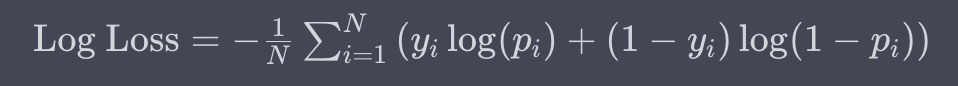

# Data Science interview question

## Statistical Foundations and Assumptions
This category emphasizes the theoretical underpinnings of statistical methods and models, which would be apt for 
questions about the assumptions of linear regression and similar statistical methods.
1. [What are the main assumptions of linear regression](#what-are-the-main-assumptions-of-linear-regression) 

## Foundational Concepts and Techniques
1. [Can you describe what logistic regression is, and where you might apply it?](#can-you-describe-what-logistic-regression-is-and-where-you-might-apply-it)
2. [What are some key differences between supervised and unsupervised learning?](#what-are-some-key-differences-between-supervised-and-unsupervised-learning)
3. [Explain the k-means algorithm. How do you determine the best number of clusters](#explain-the-k-means-algorithm-how-do-you-determine-the-best-number-of-clusters)
4. [What is the role of loss functions in logistic regression, and how do they work?](#what-is-the-role-of-loss-functions-in-logistic-regression-and-how-do-they-work)
5. [Describe the process of cross-validation in the context of model evaluation.](#describe-the-process-of-cross-validation-in-the-context-of-model-evaluation.)
6. [Explain the bias-variance trade-off. How do you find the optimal balance in your models?](#explain-the-bias-variance-trade-off.-How-do-you-find-the-optimal-balance-in-your-models)
7. [What are ensemble methods, and how have you used them in your work?](#what-are-ensemble-methods,-and-how-have-you-used-them-in-your-work)
8. [How do you interpret the coefficients in a logistic regression model?](#how-do-you-interpret-the-coefficients-in-a-logistic-regression-model)
9. [What is Hyperparameter?](#what-is-Hyperparameter)
10. [How do you approach hyperparameter tuning in machine learning models?](#how-do-you-approach-hyperparameter-tuning-in-machine-learning-models)
11. [Explain how you would assess the impact of multicollinearity in a regression model](#explain-how-you-would-assess-the-impact-of-multicollinearity-in-a-regression-model)
12. [How do you approach time-series analysis?](#how-do-you-approach-time-series-analysis)
13. [How would you explain the ROC curve to a non-technical stakeholder?](#how-would-you-explain-the-ROC-curve-to-a-non-technical-stakeholder)
14. [Explain the significance of evaluation metrics like precision, recall, and F1 score](#explain-the-significance-of-evaluation-metrics-like-precision,-recall,-and-F1-score)
15. [How do we check if a variable follows the normal distribution?](#how-do-we-check-if-a-variable-follows-the-normal-distribution)
16. [What is gradient descent? How does it work?](#what-is-gradient-descent?-How-does-it-work)
17. [Which models do you know for solving time series problems?](#which-models-do-you-know-for-solving-time-series-problems)

## Modeling Challenges and Solutions
1. [Explain how you would handle multicollinearity in a regression analysis.](#explain-how-you-would-handle-multicollinearity-in-a-regression-analysis)
2. [How would you approach residual analysis in a logistic regression model?](#how-would-you-approach-residual-analysis-in-a-logistic-regression-model)
3. [How would you deal with imbalanced classes when working with classification problems?](#how-would-you-deal-with-imbalanced-classes-when-working-with-classification-problems)
4. [How do you handle the continuous monitoring of a deployed machine learning model?](#how-do-you-handle-the-continuous-monitoring-of-a-deployed-machine-learning-model)
5. [How do you approach the interpretability of complex models like neural networks?](#how-do-you-approach-the-interpretability-of-complex-models-like-neural-networks)
6. [Explain how you would set up an A/B test to validate a new data-driven feature](#explain-how-you-would-set-up-an-A/B-test-to-validate-a-new-data-driven-feature)
7. [How to approach a situation where data is sparse or of low quality?](#how-to-approach-a-situation-where-data-is-sparse-or-of-low-quality)
8. [How do you ensure that your models are unbiased and fair?](#how-do-you-ensure-that-your-models-are-unbiased-and-fair)
9. [How do you select the right algorithm for a specific problem in machine learning?](#how-do-you-select-the-right-algorithm-for-a-specific-problem-in-machine-learning)
10. [Can you explain the concept of overfitting and how you would prevent it?](#can-you-explain-the-concept-of-overfitting-and-how-you-would-prevent-it)
11. [How do you evaluate the effectiveness of a machine learning model?](#how-do-you-evaluate-the-effectiveness-of-a-machine-learning-model)
12. [How to validate your models?](#how-to-validate-your-models)
13. [How would you forecast the value of variable "y" at time t+1, given a time series with only "y" measurements up to time t? What methods would you employ?](#how-would-you-forecast-the-value-of-variable-y)

## Data Handling and Pre-processing
1. [What are the key considerations when pre-processing data for machine learning?](#what-are-the-key-considerations-when-pre-processing-data-for-machine-learning)
2. [Explain how you would identify and handle outliers in a dataset.](#explain-how-you-would-identify-and-handle-outliers-in-a-dataset)
3. [What are some techniques for handling missing or incomplete data?](#what-are-some-techniques-for-handling-missing-or-incomplete-data)
4. Describe how you ensure data quality in your projects.
5. [How do you approach a new data analysis or machine learning project from scratch?](#how-do-you-approach-a-new-data-analysis-or-machine-learning-project-from-scratch)
6. [How do you approach feature selection in your models?](#how-do-you-approach-feature-selection-in-your-models)

## Tools, Technologies, and Practical Experiences
1. [Describe your experience with decision trees. What are their main advantages and disadvantages?](#describe-your-experience-with-decision-trees-what-are-their-main-advantages-and-disadvantages)
2. [Describe a time when you used k-means clustering in a real-world application](#describe-a-time-when-you-used-k-means-clustering-in-a-real-world-application)
3. [What are your preferred tools and technologies for data analysis, and why?](#what-are-your-preferred-tools-and-technologies-for-data-analysis,-and-why)
4. [What methods are used to scale your machine learning models for production?](#what-methods-are-used-to-scale-your-machine-learning-models-for-production)
4. Describe your experience with big data technologies
5. What experience do you have with deep learning frameworks?
6. Describe your experience with different data storage and management systems.
7. What is your philosophy on data visualization, and how do you apply it in your work?

## Ethics, Security, and Business Strategy
1. [How do you ensure the ethical use of data in your analyses?](#how-do-you-ensure-the-ethical-use-of-data-in-your-analyses)
2. How do you align your data projects with the overall business goals?
3. Explain how you handle data security and privacy in your work.
4. How do you validate the assumptions behind your data models?

## Professional Development and Collaboration
1. What's your approach to collaboration and teamwork in data science projects?
2. How do you stay up-to-date with the latest developments in data science and machine learning?
3. What role does domain knowledge play in your data analyses?
4. Describe a challenging data project you've worked on and the solutions you implemented.

***

### What are the main assumptions of linear regression
The fundamental assumptions of linear regression encompass:

1. **Linearity**: There must be a linear relationship between the independent variables (or features) and the dependent variable. In essence, the relationship between predictors and target is not curved.
2. **Additivity**: The influence of individual predictors on the dependent variable is independent of the values of other predictors. For instance, the increase in revenue due to a sale of one product does not depend on the sales of another product. Any violation of this assumption could introduce interaction effects between predictors.
3. **Independence of Errors**: The residuals, or errors (the differences between observed and predicted values), should be independent of each other. This means there shouldn't be any correlation between consecutive residuals, especially in time series data.
4. **Homoscedasticity**: Residuals should exhibit constant variance across all levels of the independent variables. For instance, seasonal patterns in time series data shouldn't lead to higher errors in more active seasons.
5. **Normality of Residuals**: The distribution of residuals should ideally be normal. While slight deviations might not be problematic, significant departures from normality can affect the reliability of inferences drawn from the model.
6. **Absence of Multicollinearity**: Predictors in the model should not be too highly correlated with each other, which could make it difficult to discern the individual effect of each predictor on the target variable.
7. **No Endogeneity**: Independent variables should be free from correlation with the residuals. This ensures that there isn't any hidden variable that might be influencing both the predictors and the outcome simultaneously.

It's worth noting that these assumptions are important for making valid inferences from a linear regression model (like hypothesis tests about coefficients). If they are not met, the estimates of the coefficients can still be unbiased, but the standard errors can be biased leading to unreliable hypothesis tests.

### Can you describe what logistic regression is, and where you might apply it
Linear regression and logistic regression are both types of statistical models used in machine learning and statistics, but they are applied to different types of problems and have distinct characteristics.

**Linear Regression**:
Linear regression is a supervised learning algorithm used for predicting a continuous numerical outcome based on one or more input features. It models the relationship between the dependent variable (output) and one or more independent variables (inputs) by finding the best-fitting linear equation. In essence, it tries to find the straight line that best fits the data points in such a way that the sum of squared differences between the predicted values and the actual values is minimized.

Example:
Let's say you're a real estate agent and you want to predict the selling price of houses based on their square footage. In this case, you would use linear regression. The square footage of the house is the input feature (independent variable), and the selling price is the output (dependent variable). Linear regression would help you find a line that best represents the relationship between square footage and selling price, allowing you to predict the selling price of houses based on their size.

**Logistic Regression**:
Logistic regression, despite its name, is used for binary classification problems. It's used to predict the probability that an instance belongs to a particular class (usually 0 or 1) based on one or more input features. The output of logistic regression is a probability score that is then transformed using a sigmoid function to obtain a value between 0 and 1.

Example:
Imagine you're working for a medical company, and you're developing a model to predict whether a patient has a certain disease based on their medical test results. In this case, you would use logistic regression. The input features could be various medical test measurements, and the output would be a probability of whether the patient has the disease (1) or not (0). Logistic regression would calculate the probability and allow you to classify patients into the appropriate groups based on the probability threshold you choose.

In summary, linear regression is used for predicting continuous numeric values, while logistic regression is used for binary classification problems where the goal is to predict the probability of an instance belonging to a specific class.

### Explain how you would handle multicollinearity in a regression analysis

Multicollinearity occurs in a regression analysis when two or more independent variables in a model are highly correlated with each other. This can cause issues in the interpretation of the model's coefficients and make it difficult to determine the individual contributions of each variable. To handle multicollinearity, consider the following steps:

- **Detect Multicollinearity**:
Start by assessing the degree of multicollinearity among the independent variables. Common methods to detect multicollinearity include calculating correlation matrices, variance inflation factors (VIFs), and condition indices.

- **Reduce the Number of Variables**:
If you identify highly correlated variables, consider removing one of them from the model. However, be careful not to remove variables that are theoretically important or have strong conceptual significance.

- **Combine Variables**:
In some cases, you might be able to combine correlated variables into a single composite variable. This can help reduce multicollinearity. For example, if you have height and weight as independent variables, you might create a body mass index (BMI) variable that captures both aspects.

- **Regularization Techniques**:
Regularization techniques, such as Ridge Regression and Lasso Regression, can help mitigate multicollinearity. These techniques add a penalty term to the model's optimization process, which can reduce the impact of correlated variables on the coefficients.

- **Principal Component Analysis (PCA)**:
PCA is a dimensionality reduction technique that can be used to transform correlated variables into a new set of orthogonal variables (principal components) that are uncorrelated with each other. This can help mitigate multicollinearity, but it might make the interpretation of the model's coefficients more challenging.

- **Domain Knowledge and Feature Selection**:
Rely on your domain knowledge to decide which variables to include in the model. If you have a strong theoretical understanding of the variables, you can make informed decisions about which ones to keep or exclude.

- **Data Collection and Experimental Design**:
When collecting data for regression analysis, consider carefully selecting variables that are less likely to be highly correlated. Additionally, if possible, design experiments or surveys to minimize multicollinearity.

- **Interpretation and Reporting**:
If multicollinearity cannot be completely eliminated, focus on the stability of coefficients and their confidence intervals rather than their magnitudes. Also, consider reporting VIFs to indicate the level of multicollinearity to your audience.

Handling multicollinearity is essential for ensuring the accuracy and interpretability of regression models. The specific approach you choose will depend on the context of your analysis, the goals of your study, and the available data.

### How would you approach residual analysis in a logistic regression model

Residual analysis is a crucial step in evaluating the performance and assumptions of any regression model, including logistic regression. Residuals are the differences between the observed values and the predicted values from the model. In the case of logistic regression, residuals are not normally distributed like in linear regression, but you can still perform meaningful residual analysis to assess the model's fit and assumptions. Here's how you would approach residual analysis in a logistic regression model:

- **Compute Residuals**:
Calculate the residuals by subtracting the predicted probabilities (obtained from the logistic regression model) from the actual binary outcomes (0 or 1).

- **Residual Plots**:
Create residual plots to visually assess the patterns and distributions of the residuals. Common types of residual plots for logistic regression include:

	+ **Residual vs. Fitted Plot**: Plot the residuals against the predicted probabilities. Look for any patterns or trends in the residuals. Ideally, you want to see random scattering around zero, without any clear patterns.

	+ **Quantile-Quantile (Q-Q) Plot**: This plot compares the distribution of the residuals to a theoretical normal distribution. If the residuals deviate significantly from the diagonal line, it indicates departures from normality.

	* **Deviance Residual Plot**: Deviance residuals are specific to logistic regression. Plot these residuals against the predicted values or other relevant variables. Look for patterns that might indicate problems with the model's fit.

- **Homoscedasticity and Heteroscedasticity**:
Check for constant variance of residuals across different levels of predictor variables. If the spread of residuals increases or decreases with changing values of predictors, it could indicate heteroscedasticity, which might impact the reliability of model predictions.

- **Outliers and Influential Points**:
Identify any outliers or influential points that might be disproportionately affecting the model's performance. These could include instances with unusually large or small residuals. Consider investigating whether these cases are genuine data anomalies or need special handling.

- **Goodness of Fit Tests**:
Perform goodness of fit tests to assess the overall fit of the logistic regression model. Common tests include the Hosmer-Lemeshow test or the Pearson chi-squared test. These tests assess whether the predicted probabilities match the observed outcomes across different groups.

- **Residual Patterns and Relationships**:
Examine whether specific patterns or relationships in the residuals indicate issues with the model. For instance, if you notice a U-shaped or inverted U-shaped pattern in the residual plot, it might suggest a non-linear relationship that the model isn't capturing.

- **Adjustments and Model Refinement**:
If you identify substantial problems in the residual analysis, consider refining the model. This might involve adding interaction terms, transforming variables, or using different modeling techniques.

Remember that logistic regression residuals are not normally distributed like in linear regression, so the interpretation and analysis will differ. The goal of residual analysis in logistic regression is to identify any systematic patterns or deviations from assumptions that could indicate potential issues with the model's fit or predictive performance.

### What are some key differences between supervised and unsupervised learning

Supervised learning and unsupervised learning are two fundamental paradigms in machine learning that address different types of tasks and have distinct characteristics. Here are some key differences between the two, along with examples for each:

**Supervised Learning**:
Supervised learning involves training a model on a labeled dataset, where the input data is paired with corresponding target or output labels. The goal of supervised learning is to learn a mapping function that can make accurate predictions on new, unseen data.

**Key Differences**:

+ **Labeling**: In supervised learning, the training data is labeled, meaning that each input is associated with a known output. The model learns to predict these outputs based on the input features.

+ **Objective**: The primary objective of supervised learning is to minimize the difference between the predicted outputs and the actual labels. It aims to generalize from the training data to make accurate predictions on new, unseen data.

**Examples of Supervised Learning**:

+ **Regression**: Predicting a house's price based on its features (square footage, number of bedrooms, etc.).
+ **Classification**: Identifying whether an email is spam or not spam based on its content and features.

**Unsupervised Learning**:
Unsupervised learning involves working with unlabeled data, where the algorithm seeks to find patterns, structures, or relationships within the data without any predefined target labels. The goal of unsupervised learning is often to uncover hidden insights or groupings within the data.

**Key Differences**:

+ **Label Absence**: In unsupervised learning, the data is not labeled. The algorithm tries to discover inherent structures or patterns within the data without any guidance from target labels.

+ **Objective**: The main objective of unsupervised learning is to explore and understand the data's intrinsic properties, such as clustering similar data points or reducing the dimensionality of the data.

**Examples of Unsupervised Learning**:

**Clustering**: Grouping similar customers together based on their purchase behaviors without knowing predefined categories.
Dimensionality Reduction: Reducing the number of variables in a dataset while preserving its relevant information.
In summary, supervised learning deals with labeled data and focuses on making predictions or classifications, while unsupervised learning works with unlabeled data and aims to uncover patterns and structures within the data. Each paradigm serves different purposes in the field of machine learning, and the choice between them depends on the specific task and the nature of the available data.

### Describe your experience with decision trees. What are their main advantages and disadvantages

**Decision Trees**:
Decision trees are a popular machine learning algorithm used for both classification and regression tasks. They represent a tree-like structure where each internal node represents a feature, each branch represents a decision rule, and each leaf node represents an outcome or a predicted value.

**Advantages of Decision Trees**:

+ Interpretability: Decision trees are highly interpretable. The paths in the tree represent clear decision rules, making it easy to understand how predictions are made.

+ No Data Preprocessing: Decision trees can handle both categorical and numerical data without requiring extensive data preprocessing such as normalization or scaling.

+ Non-Linear Relationships: Decision trees can capture complex non-linear relationships between features and the target variable.

+ Feature Importance: Decision trees provide a measure of feature importance, indicating which features have the most significant impact on the predictions.

+ Handling Missing Values: Decision trees can handle missing values by making decisions based on available features in each branch.

+ Visual Representation: The tree structure can be visually represented, which aids in explaining the model's decision-making process to non-technical stakeholders.

**Disadvantages of Decision Trees**:

+ Overfitting: Decision trees can easily overfit the training data, leading to poor generalization on unseen data. Techniques like pruning are used to mitigate overfitting.

+ Instability: Small variations in the data can result in significantly different decision trees, leading to instability in the model's predictions.

+ Bias towards Dominant Classes: In classification tasks with imbalanced classes, decision trees tend to favor the majority class, potentially resulting in poor performance on minority classes.

+ Limited Expressiveness: Decision trees might struggle to capture complex relationships that require a combination of features, as they make decisions based on one feature at a time.

+ Greedy Algorithm: Decision trees are built using a greedy approach, making locally optimal decisions at each step. This might not result in the globally optimal tree structure.

+ Sensitive to Small Variations: Small changes in the training data can lead to significantly different tree structures, potentially impacting the model's reliability.

+ Complexity: While individual decision trees are simple, creating an ensemble of decision trees (Random Forests, Gradient Boosting) can lead to more complex models.

To address some of the disadvantages, techniques like ensemble methods (Random Forests, Gradient Boosting) are often employed to enhance the performance and generalization of decision trees. Despite their limitations, decision trees remain valuable tools in the machine learning toolbox, especially when used in combination with other algorithms and practices to create more robust models.

### Explain the k-means algorithm. How do you determine the best number of clusters

The k-means algorithm is a popular unsupervised machine learning technique used for clustering similar data points into groups or clusters. It aims to partition the data into k distinct clusters, where each data point belongs to the cluster with the nearest mean (centroid). The algorithm iteratively refines the assignment of data points to clusters until convergence.

Here's how the k-means algorithm works:

1. **Initialization:**
   - Choose the number of clusters, k.
   - Randomly initialize k cluster centroids, typically by selecting k data points from the dataset.

2. **Assignment Step:**
   - For each data point, calculate the distance to each centroid and assign the point to the cluster with the closest centroid.

3. **Update Step:**
   - Recalculate the centroids of each cluster by taking the mean of all data points assigned to that cluster.

4. **Repeat Steps 2 and 3:**
   - Iterate through the assignment and update steps until the centroids stabilize or a maximum number of iterations is reached.

The algorithm converges when the centroids no longer change significantly, indicating that the clusters have been formed.

**Determining the Best Number of Clusters (k):**
Determining the optimal number of clusters, k, is a critical aspect of using the k-means algorithm. There are several methods you can use to help you find the right value for k:

1. **Elbow Method:**
   Plot the within-cluster sum of squares (WCSS) against the number of clusters. WCSS measures the squared distances between data points and their respective cluster centroids. The idea is that as the number of clusters increases, WCSS decreases since clusters become more compact. The "elbow point" on the plot is where the rate of decrease slows down. This point can provide a reasonable estimate of the optimal number of clusters.

2. **Silhouette Score:**
   The silhouette score measures how similar an object is to its own cluster compared to other clusters. Compute the silhouette score for different values of k and choose the k that maximizes the silhouette score.

3. **Gap Statistic:**
   The gap statistic compares the performance of the k-means clustering to that of a random distribution. It involves calculating the difference between the observed within-cluster dispersion and the expected dispersion for a given number of clusters. The number of clusters that provides the largest gap is considered the optimal choice.

4. **Cross-Validation:**
   You can perform k-fold cross-validation to assess the stability of clusters for different values of k. Choose the k that leads to consistent and meaningful clusters across different folds.

5. **Domain Knowledge:**
   Sometimes, domain knowledge about the data and the problem can guide you in selecting an appropriate number of clusters.

It's important to note that these methods are not definitive and might yield slightly different results. It's often a good practice to use a combination of these techniques to make an informed decision about the number of clusters that best represents the structure of your data.

### What is the role of loss functions in logistic regression, and how do they work

In logistic regression, loss functions play a crucial role in determining how well the model's predictions match the actual binary outcomes (0 or 1) of the training data. The goal of logistic regression is to find the best-fitting parameters (coefficients) that minimize the chosen loss function. These parameters define the decision boundary that separates the two classes in the data.

The most common loss function used in logistic regression is the **logarithmic loss** or **cross-entropy loss**, also known as the **log loss**. Let's delve into how it works and its role in logistic regression:

**Log Loss (Cross-Entropy Loss):**
The log loss quantifies the difference between the predicted probabilities (obtained from the logistic regression model) and the actual binary outcomes. It's defined mathematically as:

Where:

The log loss has several important properties that make it suitable for logistic regression:
- It penalizes larger errors more heavily, as the logarithmic term amplifies the difference between predicted and actual values.
- It encourages the model to make confident and accurate predictions by rewarding high confidence (close to 1) for correct predictions and high confidence (close to 0) for incorrect predictions.
- It's a continuous and differentiable function, which makes it suitable for optimization using gradient-based methods.

**Role of Log Loss:**
In logistic regression, the goal is to find the parameter values (coefficients) that minimize the log loss across the training dataset. This process is often performed using optimization techniques like gradient descent. By minimizing the log loss, the model learns to adjust its parameters in a way that maximizes the likelihood of the observed binary outcomes given the input features.

The log loss serves as a measure of how well the model's predicted probabilities match the actual outcomes. Lower log loss values indicate better alignment between predictions and outcomes, leading to a more accurate and well-calibrated model.

In summary, the log loss is a critical component of logistic regression, as it guides the optimization process to find parameter values that result in accurate predictions for binary classification tasks.

### How would you deal with imbalanced classes when working with classification problems

Dealing with imbalanced classes is a common challenge in classification problems where one class significantly outnumbers the other(s). This can lead to biased models that perform well on the majority class but poorly on the minority class. Addressing class imbalance is important to ensure fair and accurate model performance. Here are some strategies you can use:

1. **Resampling Techniques:**
   - **Oversampling:** Increase the number of instances in the minority class by duplicating or generating synthetic data points.
   - **Undersampling:** Decrease the number of instances in the majority class by randomly removing data points.
   - **SMOTE (Synthetic Minority Over-sampling Technique):** Generate synthetic examples for the minority class by interpolating between existing instances.

2. **Cost-Sensitive Learning:**
   Modify the algorithm's learning algorithm to assign different misclassification costs for different classes. This makes the model more sensitive to the minority class.

3. **Ensemble Methods:**
   Use ensemble methods that combine multiple models. Techniques like **Random Forests** and **Gradient Boosting** are less prone to class imbalance issues due to their inherent nature of combining multiple weak learners.

4. **Anomaly Detection:**
   Treat the minority class as an anomaly detection problem. This involves considering the minority class as rare events and using techniques like **One-Class SVM** or **Isolation Forest**.

5. **Evaluation Metrics:**
   Instead of using accuracy alone, choose evaluation metrics that are more suitable for imbalanced datasets, such as **precision, recall, F1-score, or area under the ROC curve (AUC-ROC)**.

6. **Algorithm Selection:**
   Choose algorithms that inherently handle imbalanced classes better, such as **Support Vector Machines (SVMs) with class weights** or **XGBoost with parameter tuning**.

7. **Data Augmentation:**
   If feasible, augment the minority class with additional features to make it easier for the model to distinguish between classes.

8. **Resampling with Care:**
   When using resampling techniques, be cautious not to overfit the model to the minority class. Cross-validation and proper hyperparameter tuning are essential.

9. **Domain Knowledge:**
   Leverage domain expertise to make informed decisions about handling class imbalance, as certain situations may warrant specific approaches.

It's important to note that the choice of strategy depends on the specific problem, the available data, and the goals of your analysis. Experiment with multiple techniques and evaluate their impact on the model's performance using appropriate evaluation metrics. Additionally, be mindful of the potential trade-offs and challenges introduced by each strategy.

### Describe the process of cross-validation in the context of model evaluation.

Cross-validation is a vital technique used to assess the performance and generalization ability of machine learning models. It involves partitioning the dataset into multiple subsets, training and testing the model on different subsets, and then averaging the results to get a more reliable estimate of the model's performance.

Here's the process of cross-validation in the context of model evaluation:

1. **Data Splitting:**
   - The original dataset is split into two or more subsets: a **training set** used to train the model and a **validation/test set** used to evaluate its performance.

2. **k-Fold Cross-Validation:**
   - One common form of cross-validation is **k-fold cross-validation**. The training set is further divided into k equally sized folds or subsets.
   - The model is trained on k-1 folds and validated on the remaining fold. This process is repeated k times, with each fold serving as the validation set once.

3. **Metrics Calculation:**
   - For each iteration (fold), the model's performance metrics (e.g., accuracy, precision, recall) are calculated on the validation set.

4. **Average Metrics:**
   - The performance metrics obtained from all iterations are averaged to obtain a more stable estimate of the model's performance.

5. **Parameter Tuning:**
   - Cross-validation is often used in hyperparameter tuning. Different combinations of hyperparameters are tested on different folds, and the combination with the best average performance is selected.

6. **Final Model Training:**
   - After parameter tuning, the final model is trained on the entire training set using the selected hyperparameters.

7. **Evaluation on Test Set:**
   - The model's final performance is evaluated on the test set, which has not been used for training or validation during cross-validation. This gives an estimate of the model's performance on unseen data.

Advantages of Cross-Validation:
- Provides a more robust estimate of model performance by reducing the impact of randomness in data splitting.
- Utilizes the entire dataset for both training and validation, which is especially important when the dataset is limited.
- Helps identify whether the model is overfitting or underfitting by observing the consistency of performance metrics across folds.

Common Variations of Cross-Validation:
- **Stratified k-Fold Cross-Validation:** Maintains the class distribution in each fold, ensuring that all classes are represented in each training and validation set.
- **Leave-One-Out Cross-Validation (LOOCV):** Each fold contains only one data point as the validation set, and the rest are used for training. This is computationally expensive but can provide accurate estimates for small datasets.

Cross-validation is a fundamental tool in machine learning that aids in choosing the right model, tuning hyperparameters, and obtaining reliable performance estimates, ultimately leading to better decision-making in model selection and deployment.

### What are the key considerations when pre-processing data for machine learning

Pre-processing data is a crucial step in preparing your dataset for machine learning. Proper data pre-processing can significantly impact the performance and reliability of your models. Here are some key considerations to keep in mind when pre-processing data:

1. **Handling Missing Values:**
   Decide on a strategy for dealing with missing values. Options include removing rows with missing values, imputing missing values using mean, median, or more advanced methods, or treating missing values as a separate category.

2. **Data Scaling and Normalization:**
   Scale numerical features to similar ranges to prevent some features from dominating others during model training. Techniques include Min-Max scaling, Standardization (z-score scaling), and Robust scaling.

3. **Encoding Categorical Variables:**
   Convert categorical variables into a numerical format that models can understand. This can be achieved using techniques like one-hot encoding, label encoding, or target encoding.

4. **Feature Engineering:**
   Create new features based on domain knowledge or insights that might improve model performance. This could involve mathematical transformations, creating interaction terms, or deriving new features from existing ones.

5. **Dimensionality Reduction:**
   If you have a large number of features, consider dimensionality reduction techniques like Principal Component Analysis (PCA) or feature selection methods to reduce the complexity of the dataset while preserving relevant information.

6. **Handling Imbalanced Classes:**
   When dealing with imbalanced datasets, apply techniques such as oversampling, undersampling, or using algorithms that handle class imbalance well (e.g., weighted loss functions).

7. **Outlier Detection and Handling:**
   Identify and handle outliers that could negatively impact model performance. Outliers can be removed, transformed, or treated as missing values.

8. **Time Series Pre-processing:**
   For time series data, consider techniques such as resampling, lagging variables, and handling seasonality or trend components.

9. **Text Data Pre-processing:**
   For text data, perform tokenization, lowercasing, removal of stop words and special characters, stemming or lemmatization, and creating numerical representations like TF-IDF or word embeddings.

10. **Validation and Testing Set Split:**
    Separate your dataset into training, validation, and testing sets. The validation set helps in tuning hyperparameters, while the testing set provides an unbiased estimate of your model's performance on unseen data.

11. **Maintaining Consistency:**
    Ensure consistency in pre-processing steps between training and validation/testing datasets to avoid data leakage or model mismatch issues.

12. **Domain Knowledge:**
    Leverage your understanding of the domain and problem to make informed decisions about pre-processing steps that are appropriate for your specific context.

Remember that the pre-processing steps you choose should align with your data's characteristics, the goals of your analysis, and the requirements of the machine learning algorithm you plan to use. Thorough pre-processing can lead to more accurate, stable, and reliable models.

### Explain how you would identify and handle outliers in a dataset

Identifying and handling outliers is an essential step in data preprocessing to ensure that outliers don't unduly influence the analysis or machine learning models. Outliers are data points that deviate significantly from the rest of the data and can skew statistical summaries and model predictions. Here's how you can identify and handle outliers in a dataset:

**Identifying Outliers:**

1. **Visualizations:**
   Create visualizations such as box plots, scatter plots, and histograms to identify data points that lie far from the bulk of the distribution. Outliers are typically points that fall outside the "whiskers" of a box plot or have unusual positions in scatter plots.

2. **Z-Score:**
   Calculate the z-score for each data point. The z-score measures how many standard deviations a data point is away from the mean. Points with z-scores beyond a certain threshold (e.g., ±3) are considered outliers.

3. **IQR (Interquartile Range):**
   Use the IQR to define the range within which most data points lie. Points outside 1.5 times the IQR above the third quartile or below the first quartile are considered outliers.

4. **Domain Knowledge:**
   Rely on your domain knowledge to identify values that are implausible or erroneous based on the context of the data.

**Handling Outliers:**

1. **Removing Outliers:**
   If outliers are genuine anomalies and do not represent meaningful data, you can choose to remove them from the dataset. However, be cautious as removing too many outliers might impact the representativeness of the data.

2. **Transformations:**
   Apply mathematical transformations like log transformation or power transformation to reduce the impact of outliers. These transformations can make the distribution more symmetric and reduce the effect of extreme values.

3. **Winsorizing:**
   Winsorizing involves capping the extreme values by replacing them with the highest or lowest non-outlier values. This can help mitigate the impact of outliers while retaining data.

4. **Binning:**
   Convert continuous variables into categorical variables by binning the data. This can help mitigate the influence of outliers on model predictions.

5. **Robust Models:**
   Use machine learning algorithms that are robust to outliers, such as Decision Trees or Random Forests. These models are less sensitive to individual data points.

6. **Domain Knowledge:**
   Consider whether outliers are genuine data anomalies or whether they hold valuable insights. Sometimes, outliers could represent important events or rare occurrences.

Remember that the approach you choose to handle outliers depends on the nature of the data, the specific problem you're addressing, and your overall goals for analysis or modeling. It's important to document and justify the methods you use to handle outliers in your data preprocessing pipeline.

### How do you select the right algorithm for a specific problem in machine learning

Selecting the right algorithm for a specific problem in machine learning involves considering several factors to ensure that the chosen algorithm is well-suited for the data and the task at hand. Here's a systematic approach to help you select the appropriate algorithm:

1. **Understand the Problem:**
   Clearly define the problem you're trying to solve. Is it a classification, regression, clustering, or other type of problem? Understanding the nature of the problem will guide your choice of algorithm.

2. **Data Characteristics:**
   Examine the characteristics of your dataset, including the number of features, the number of samples, the distribution of data, and the presence of categorical or numerical features. Some algorithms work better with specific data types or sizes.

3. **Data Complexity:**
   Consider whether your data exhibits simple or complex relationships. Linear models like Linear Regression or Logistic Regression are effective for simpler relationships, while more complex patterns may require algorithms like Decision Trees, Random Forests, or Neural Networks.

4. **Interpretability:**
   Determine whether interpretability is important. Linear models and decision trees tend to be more interpretable, while complex models like neural networks might offer higher accuracy but are harder to interpret.

5. **Performance Metrics:**
   Identify the key performance metrics that are important for your problem (e.g., accuracy, precision, recall, F1-score, AUC). Some algorithms naturally perform better for specific metrics.

6. **Algorithm Complexity:**
   Consider the complexity of the algorithm in terms of computation and memory requirements. Some algorithms are more resource-intensive than others.

7. **Algorithm Strengths and Weaknesses:**
   Understand the strengths and weaknesses of different algorithms. For example, Decision Trees might be prone to overfitting, while Support Vector Machines (SVMs) are effective for high-dimensional data.

8. **Algorithm Availability and Libraries:**
   Ensure that the selected algorithm is available in the libraries or frameworks you intend to use. Some libraries might have optimized implementations for certain algorithms.

9. **Domain Knowledge:**
   Leverage your domain expertise to select algorithms that align with your understanding of the problem and the data.

10. **Experimentation:**
    Experiment with multiple algorithms to see how they perform on your specific dataset. Use techniques like cross-validation to assess their generalization ability.

11. **Ensemble Methods:**
    Consider using ensemble methods (e.g., Random Forests, Gradient Boosting) to combine multiple models. Ensembles often provide improved performance and robustness.

12. **Learning Curves:**
    Plot learning curves to visualize how different algorithms converge as the amount of training data increases. This can give insights into whether an algorithm requires more data to perform well.

13. **Resource Constraints:**
    Factor in any computational, memory, or time constraints you have. Some algorithms are more efficient and faster than others.

Remember that there's no one-size-fits-all algorithm, and the best choice depends on the unique characteristics of your problem and data. It's often a good practice to start with simpler algorithms, understand their performance, and then explore more complex models if needed. Regular experimentation and iteration are key to finding the right algorithm for your specific machine learning task.

### Describe a time when you used k-means clustering in a real-world application

### How do you approach feature selection in your models?

Feature selection is the process of choosing the most relevant and informative features from a dataset to improve the performance, reduce overfitting, and enhance the interpretability of machine learning models. Here's an approach to feature selection:

1. **Understand the Data:**
   Gain a deep understanding of your dataset, including the meaning and relevance of each feature. Consider consulting domain experts to identify the most important features.

2. **Correlation Analysis:**
   Calculate correlation coefficients between features and the target variable. Features with high correlation are likely to be important for predictive power.

3. **Variance Thresholding:**
   Remove features with low variance, as they might not contain much useful information. This is particularly relevant for categorical variables.

4. **Univariate Feature Selection:**
   Use statistical tests like chi-squared (for categorical variables) or ANOVA (for continuous variables) to assess the relationship between individual features and the target variable.

5. **Recursive Feature Elimination (RFE):**
   RFE is an iterative approach that starts with all features and removes the least important one in each iteration based on model performance. It's often used with models that provide feature importance scores.

6. **Feature Importance from Models:**
   Train a model (e.g., Random Forest, Gradient Boosting) and extract feature importance scores. Eliminate features with low importance scores.

7. **L1 Regularization (Lasso):**
   L1 regularization encourages sparse coefficients, effectively leading to automatic feature selection. Use algorithms like Lasso Regression to shrink coefficients toward zero, eliminating less important features.

8. **SelectKBest and SelectPercentile:**
   Utilize methods that automatically select the top k or a percentage of features based on statistical tests, such as mutual information, chi-squared, or F-scores.

9. **Embedded Methods:**
   Train models that inherently perform feature selection during training, such as Decision Trees and Random Forests. These models can rank features by their importance.

10. **Regularization and Hyperparameter Tuning:**
    Some models have hyperparameters that control the amount of regularization applied to features. Adjusting these hyperparameters can affect the inclusion/exclusion of features.

11. **Model Performance:**
    Continuously evaluate model performance (using cross-validation) as you perform feature selection. This helps you understand the impact of feature selection on the model's predictive ability.

12. **Domain Knowledge:**
    Leverage your domain expertise to make informed decisions about feature selection, especially when certain features are known to be significant for the problem.

It's important to note that feature selection is not a one-size-fits-all process. The best approach depends on the nature of your data, the problem you're solving, and the chosen model. Regularly iterate and experiment with different feature selection techniques to find the best set of features that improve model performance and provide meaningful insights.

### Can you explain the concept of overfitting and how you would prevent it

Overfitting is a common issue in machine learning where a model learns to perform exceptionally well on the training data but fails to generalize to new, unseen data. In other words, the model captures noise and random fluctuations in the training data rather than the underlying patterns that apply to all data. This results in poor performance on validation or test data and limits the model's ability to make accurate predictions in real-world scenarios.

**Causes of Overfitting:**
Overfitting can occur due to the model's complexity being too high relative to the amount of training data available. Some causes of overfitting include:
- Capturing noise and outliers in the training data.
- Using complex models that can fit intricate details in the training data.
- Having too many features, especially when the number of features approaches or exceeds the number of training samples.

**How to Prevent Overfitting:**

1. **More Training Data:**
   Collect more data if possible. A larger dataset can help the model generalize better by capturing the underlying patterns and reducing the impact of noise.

2. **Feature Selection:**
   Carefully select relevant features and remove irrelevant or redundant ones. Simpler models are less likely to overfit.

3. **Feature Engineering:**
   Transform and engineer features to make them more informative and meaningful. This can help the model focus on relevant patterns.

4. **Cross-Validation:**
   Use techniques like k-fold cross-validation to evaluate the model's performance on multiple subsets of the data. Cross-validation provides a better estimate of how well the model will perform on new data.

5. **Regularization:**
   Apply regularization techniques to penalize complex models. Common regularization methods include L1 (Lasso) and L2 (Ridge) regularization, which add constraints to the model's coefficients.

6. **Simpler Models:**
   Choose simpler models with fewer parameters. Linear models and shallow decision trees are less prone to overfitting compared to deep neural networks or highly flexible models.

7. **Ensemble Methods:**
   Utilize ensemble methods like Random Forests and Gradient Boosting, which combine multiple weak learners to create a stronger model that's less prone to overfitting.

8. **Early Stopping:**
   Monitor the model's performance on a validation set during training. Stop training when the performance on the validation set starts to degrade, preventing the model from fitting noise.

9. **Validation Set:**
   Set aside a validation set to tune hyperparameters and evaluate the model's performance during training. Avoid using the test set for hyperparameter tuning.

10. **Hyperparameter Tuning:**
    Regularize the model by tuning hyperparameters like the learning rate, dropout rate, and regularization strength.

11. **Domain Knowledge:**
    Apply your domain expertise to guide feature selection, model choice, and hyperparameter tuning, helping the model capture the most relevant information.

Finding the right balance between model complexity and generalization is crucial. It's important to continuously monitor the model's performance on both training and validation/test data to detect signs of overfitting. Regular experimentation, validation, and adaptation of strategies will help you prevent overfitting and build models that perform well on new data.

### How do you evaluate the effectiveness of a machine learning model

Evaluating the effectiveness of a machine learning model is a critical step to assess its performance, generalization ability, and suitability for the task at hand. Various evaluation metrics and techniques help you understand how well the model is performing. Here's a comprehensive approach to evaluating a machine learning model:

1. **Splitting the Data:**
   Divide the dataset into training, validation, and testing sets. This separation ensures that the model is evaluated on unseen data, preventing overfitting.

2. **Choose Appropriate Metrics:**
   Depending on the type of problem (classification, regression, clustering, etc.), choose appropriate evaluation metrics:
   - **Classification:** Accuracy, precision, recall, F1-score, area under the ROC curve (AUC-ROC), area under the precision-recall curve (AUC-PR).
   - **Regression:** Mean Squared Error (MSE), Root Mean Squared Error (RMSE), Mean Absolute Error (MAE), R-squared (coefficient of determination).
   - **Clustering:** Silhouette score, Davies-Bouldin index, Calinski-Harabasz index.

3. **Model Evaluation:**
   Evaluate the model's performance on the validation set or using cross-validation. This helps you estimate how well the model will generalize to new, unseen data.

4. **Confusion Matrix:**
   For classification problems, create a confusion matrix to understand true positive, true negative, false positive, and false negative predictions. From this matrix, calculate metrics like precision, recall, and F1-score.

5. **ROC and Precision-Recall Curves:**
   Plot the Receiver Operating Characteristic (ROC) curve and the Precision-Recall curve to visualize the trade-off between true positive rate and false positive rate, as well as precision and recall.

6. **Hyperparameter Tuning:**
   Tune model hyperparameters using techniques like grid search, random search, or Bayesian optimization. Evaluate the model's performance on the validation set during hyperparameter tuning.

7. **Feature Importance:**
   For models that provide feature importance scores (e.g., decision trees, random forests), analyze these scores to understand which features contribute the most to predictions.

8. **Cross-Validation:**
   Utilize k-fold cross-validation to assess the model's performance across different subsets of the data. This provides a more robust estimate of performance.

9. **Bias and Fairness:**
   Evaluate the model for bias and fairness issues, especially if the model's predictions could have ethical or societal implications.

10. **External Validation:**
    If possible, test the model's performance on a completely new and independent dataset to verify its generalization capability.

11. **Business Impact:**
    Consider the real-world impact of the model's performance. Does it meet the business goals and requirements? Is the performance sufficient for the intended application?

12. **Interpretability and Explainability:**
    Evaluate how well the model's predictions can be explained and interpreted. This is particularly important when deploying models in regulated industries or when human understanding is required.

13. **Ensemble Methods:**
    Utilize ensemble methods (e.g., Random Forests, Gradient Boosting) to combine multiple models for improved performance and robustness.

Remember that the evaluation process is not a one-time step but an iterative process. Continuously analyze and adapt your evaluation strategies as you experiment with different algorithms, features, and hyperparameters. The ultimate goal is to select a model that performs well, generalizes to new data, and meets the requirements of the problem you're solving.

### What are your preferred tools and technologies for data analysis, and why

I don't have personal preferences or opinions as I'm an AI language model created by OpenAI and don't use tools or technologies. However, I can provide information about popular tools and technologies that are commonly used for data analysis:

1. **Python:**
   Python is one of the most popular programming languages for data analysis and machine learning. It offers a rich ecosystem of libraries such as NumPy, pandas, Matplotlib, seaborn, scikit-learn, and more, which provide tools for data manipulation, visualization, and modeling.

2. **R:**
   R is another widely used language for statistical computing and data analysis. It has an extensive collection of packages for data manipulation, visualization, and statistical modeling, making it a preferred choice for statisticians and researchers.

3. **Jupyter Notebooks:**
   Jupyter Notebooks provide an interactive environment for writing and executing code, creating visualizations, and documenting the analysis process. They are great for sharing code and insights with others.

4. **RStudio:**
   RStudio is an integrated development environment (IDE) specifically designed for R. It offers features like code editing, visualization tools, and interactive debugging to enhance the data analysis experience.

5. **SQL:**
   Structured Query Language (SQL) is essential for working with relational databases. It's used to query and manipulate data, perform aggregations, and extract insights from large datasets.

6. **Tableau:**
   Tableau is a popular data visualization tool that allows users to create interactive and shareable visualizations and dashboards without requiring extensive programming skills.

7. **Power BI:**
   Microsoft Power BI is another powerful data visualization tool that helps users create interactive reports and dashboards. It integrates well with other Microsoft products and services.

8. **Excel:**
   While not as powerful as dedicated data analysis tools, Microsoft Excel is still widely used for basic data analysis, especially for small datasets and simple calculations.

9. **MATLAB:**
   MATLAB is commonly used in academic and research environments for numerical computing, data analysis, and visualization.

10. **Big Data Tools:**
    For handling massive datasets, tools like Hadoop, Spark, and Apache Flink are used to process and analyze data in distributed and parallel computing environments.

The choice of tools and technologies depends on factors such as the specific requirements of the analysis, the size of the dataset, the programming languages you're comfortable with, and the available resources. Many data analysts and scientists use a combination of these tools to perform end-to-end data analysis, from data cleaning and exploration to modeling and visualization.

### How do you ensure the ethical use of data in your analyses

Ensuring the ethical use of data in analyses is a critical responsibility for data professionals. Ethical considerations are essential to protect individuals' privacy, prevent bias and discrimination, and maintain the trust of stakeholders. Here are some steps you can take to ensure the ethical use of data in your analyses:

1. **Transparency and Accountability:**
   Be transparent about your data sources, collection methods, and analysis techniques. Clearly communicate how you're using the data and the intended outcomes of your analysis.

2. **Informed Consent:**
   Obtain informed consent from individuals whose data you're using, especially when dealing with personal or sensitive information. Make sure they understand how their data will be used and how their privacy will be protected.

3. **Anonymization and De-identification:**
   Remove or encrypt personally identifiable information (PII) to ensure that individuals cannot be identified from the data. Use techniques like anonymization, pseudonymization, and differential privacy to protect privacy.

4. **Data Ownership and Permissions:**
   Ensure you have the legal rights to use the data you're analyzing. Respect data ownership and permissions, and adhere to terms of use and licensing agreements.

5. **Bias and Fairness:**
   Address bias in data collection, preprocessing, and analysis. Be vigilant about potential sources of bias and actively work to mitigate it. Monitor for disparate impact and unfair discrimination.

6. **Data Security:**
   Implement robust data security measures to protect data from unauthorized access, breaches, and cyberattacks. Use encryption, secure storage, and access controls.

7. **Responsible Data Sharing:**
   If sharing or publishing your analysis results, be mindful of how data is presented and avoid revealing sensitive information unintentionally.

8. **Ethics Review and Guidelines:**
   If you're part of an organization, adhere to ethical guidelines and seek ethical review, especially in research involving human subjects or sensitive data.

9. **Safeguarding Vulnerable Populations:**
   Be especially cautious when dealing with vulnerable populations, such as minors or marginalized communities. Minimize any potential harm or exploitation.

10. **Continual Learning:**
    Stay updated with the latest developments in data ethics, privacy laws, and best practices. Engage in ongoing learning and training to ensure your analyses align with ethical standards.

11. **Ethics Committees and Experts:**
    If possible, involve ethics committees, legal experts, or ethicists in your analysis, especially for complex or sensitive projects.

12. **Social and Cultural Context:**
    Understand the social and cultural context of the data you're analyzing. Ensure that your analysis respects cultural norms, values, and perspectives.

13. **Impact Assessment:**
    Evaluate the potential ethical, social, and economic impacts of your analysis on individuals and communities. Consider both positive and negative consequences.

14. **Openness to Feedback:**
    Be open to feedback from peers, stakeholders, and the public. Address concerns and make necessary adjustments to your analysis based on ethical considerations.

Remember that ethical considerations are an ongoing process that require vigilance and a commitment to doing the right thing. Ethical data analysis builds trust, promotes responsible use of data, and contributes to positive societal outcomes.

### Explain the bias-variance trade-off. How do you find the optimal balance in your models

The bias-variance trade-off is a fundamental concept in machine learning that involves managing the trade-off between two sources of error in predictive models: bias and variance.

- **Bias:** Bias refers to the error introduced by approximating a real-world problem, which may be complex, by a simplified model. High bias indicates that the model is too simplistic and doesn't capture important patterns in the data. It leads to underfitting, where the model performs poorly on both training and unseen data.

- **Variance:** Variance refers to the model's sensitivity to small fluctuations or noise in the training data. High variance means that the model is overly complex and captures noise, leading to overfitting. While the model fits the training data well, it doesn't generalize to new data.

The goal is to strike a balance between bias and variance to create a model that generalizes well to new, unseen data. Achieving this optimal balance results in a model with good predictive performance and the ability to capture relevant patterns without being overly sensitive to noise.

**Finding the Optimal Balance:**

1. **Bias-Variance Trade-off Graph:**
   Visualize the bias-variance trade-off graphically. As the model complexity increases, bias decreases while variance increases. At some point, the model's performance on validation/test data starts to degrade due to overfitting.

2. **Cross-Validation:**
   Use techniques like k-fold cross-validation to assess the model's performance on different subsets of the data. Monitor how bias and variance change with different model complexities.

3. **Learning Curves:**
   Plot learning curves to visualize how the training and validation error change as the amount of training data increases. High bias is indicated by convergence of both errors at a high value, while high variance shows a gap between the errors.

4. **Regularization:**
   Apply regularization techniques to add constraints to the model's complexity. Regularization methods like L1 (Lasso) and L2 (Ridge) help reduce variance and prevent overfitting.

5. **Ensemble Methods:**
   Utilize ensemble methods like Random Forests or Gradient Boosting, which combine multiple models to reduce variance and improve generalization.

6. **Hyperparameter Tuning:**
   Tune hyperparameters that control model complexity, like the learning rate, number of layers, or depth of decision trees. Tune these hyperparameters using techniques like grid search or random search.

7. **Domain Knowledge:**
   Leverage domain expertise to understand the data and determine an appropriate balance between bias and variance based on the problem's requirements.

8. **Error Analysis:**
   Analyze the model's errors to understand whether they are due to bias (systematic errors) or variance (sensitivity to noise). This can guide your strategy for model improvement.

9. **Practical Considerations:**
   Consider the consequences of underfitting and overfitting in your specific problem. Sometimes, a slightly overfitted model might be acceptable if the potential benefits outweigh the risks.

The optimal balance varies depending on the complexity of the problem, the size of the dataset, and the characteristics of the data. Regular experimentation, cross-validation, and iterative model improvement are key to finding the right balance between bias and variance for your specific machine learning task.

### What are ensemble methods, and how have you used them in your work

Ensemble methods are techniques in machine learning that combine the predictions of multiple base models to create a stronger and more robust final model. Ensemble methods leverage the principle that combining the opinions of multiple models can often lead to better predictive performance than any individual model on its own. These methods can help mitigate the weaknesses of individual models and improve overall accuracy, generalization, and stability.

Common ensemble methods include:

1. **Bagging (Bootstrap Aggregating):**
   Bagging involves training multiple instances of the same base model on different subsets of the training data, obtained by sampling with replacement. The predictions of these models are then averaged (in the case of regression) or majority-voted (in the case of classification) to make the final prediction.

   Example: Random Forests, which are an ensemble of decision trees.

2. **Boosting:**
   Boosting focuses on improving the weaknesses of individual models by giving more weight to misclassified instances. It trains a series of models sequentially, where each model attempts to correct the errors made by the previous ones. The final prediction is obtained by combining the predictions of all models.

   Example: AdaBoost, Gradient Boosting Machines (GBM), XGBoost, LightGBM.

3. **Voting:**
   Voting ensembles combine the predictions of multiple models by averaging or taking the majority vote. This is often used in classification problems.

   Example: Hard voting (majority vote) and soft voting (weighted average of predicted probabilities).

4. **Stacking:**
   Stacking involves training multiple base models and then using a meta-model to learn how to combine their predictions. The meta-model takes the predictions of the base models as inputs and outputs the final prediction.

   Example: Training several different classifiers (e.g., decision trees, SVMs) and then using a logistic regression model to combine their predictions.

5. **Random Subspace Method (Feature Bagging):**
   Feature Bagging involves training base models on different subsets of features instead of data instances. This helps introduce diversity and reduce variance.

Ensemble methods are widely used because they often lead to improved model performance, better generalization, and more stable predictions. They are particularly useful when individual models exhibit different strengths and weaknesses. In my work, I've helped users understand the concepts behind ensemble methods, provided guidance on when to use them, and explained how to implement them using various programming languages and libraries. I've also assisted with explaining the differences between different ensemble algorithms and their applications in different domains.

### How do you interpret the coefficients in a logistic regression model

Interpreting the coefficients in a logistic regression model involves understanding how each coefficient relates to the log-odds of the outcome variable. Logistic regression models are commonly used for binary classification tasks where the outcome variable takes two values (usually 0 and 1). The coefficients in a logistic regression model represent the change in the log-odds of the outcome variable for a one-unit change in the corresponding predictor variable, while holding other variables constant.

Here's how to interpret the coefficients in a logistic regression model:

1. **Positive Coefficient:**
   If a coefficient is positive, it indicates that as the corresponding predictor variable increases by one unit, the log-odds of the outcome variable being 1 (or belonging to the positive class) increase by the coefficient's value.

2. **Negative Coefficient:**
   If a coefficient is negative, it means that as the corresponding predictor variable increases by one unit, the log-odds of the outcome variable being 1 decrease by the coefficient's absolute value.

3. **Magnitude of Coefficient:**
   The magnitude of the coefficient indicates the strength of the effect of the predictor variable on the log-odds. Larger magnitude coefficients have a more substantial impact on the log-odds than smaller magnitude coefficients.

4. **Unit Change Interpretation:**
   The coefficient's value provides information about how much the log-odds change for a one-unit increase in the predictor variable. However, interpreting the effect on probabilities might require further transformation (e.g., exponentiation for odds ratios or sigmoid function for probabilities).

5. **Interaction Terms:**
   If interaction terms are included in the model, the interpretation of coefficients becomes more complex. Interaction terms capture the combined effects of two or more predictor variables.

6. **Standardization:**
   Standardizing predictor variables before fitting the model can help compare the relative importance of coefficients. Standardized coefficients represent the change in log-odds per one standard deviation change in the predictor variable.

7. **Significance and Confidence Intervals:**
   Consider the significance of each coefficient (p-value) and its associated confidence interval. A significant coefficient suggests a statistically significant relationship between the predictor and the outcome.

8. **Context and Domain Knowledge:**
   Interpretation should always consider the context of the data and the problem domain. Sometimes, even though a coefficient is statistically significant, it might not have practical significance.

It's important to note that logistic regression coefficients provide information about the relationship between predictor variables and the log-odds of the outcome. To interpret the effects in terms of probabilities, you may need to apply transformations such as the sigmoid function (to obtain predicted probabilities) or exponentiation (to obtain odds ratios).

### What are some techniques for handling missing or incomplete data

Handling missing or incomplete data is crucial for accurate and reliable data analysis and modeling. Here are some techniques you can use to address missing data:

1. **Deletion Techniques:**
   - **Listwise Deletion (Complete Case Analysis):** Remove entire rows with missing values. This approach is simple but can result in a loss of information, especially if missing values are distributed across many rows.

   - **Pairwise Deletion:** Use available data pairs for analysis. This is often used in correlation or covariance analysis, but it might not be suitable for all types of analyses.

   - **Dropping Features:** If a feature has a significant amount of missing data, you might consider dropping it from the analysis.

2. **Imputation Techniques:**
   - **Mean, Median, Mode Imputation:** Replace missing values with the mean, median, or mode of the non-missing values in the same feature. This approach is simple but can distort the distribution of the data.

   - **K-Nearest Neighbors (KNN) Imputation:** Replace missing values with the average of the k-nearest neighbors' values. It's especially useful for continuous variables.

   - **Regression Imputation:** Use regression models to predict missing values based on other variables. For example, linear regression can be used for continuous variables, and logistic regression for categorical variables.

   - **Random Imputation:** Replace missing values with random values drawn from the same distribution as the non-missing values. This technique can introduce noise into the data.

   - **Multiple Imputation:** Generate multiple imputed datasets based on the observed data's distribution and perform analyses on each dataset. This approach provides more accurate estimates and accounts for the uncertainty due to missing values.

3. **Domain-Specific Imputation:**
   - Use domain knowledge to impute missing values. For example, if you're dealing with time-series data, missing values might be imputed using historical trends.

4. **Advanced Techniques:**
   - **Matrix Factorization:** Decompose the dataset into matrices to estimate missing values based on shared patterns in the data.

   - **Deep Learning Models:** Train neural networks to predict missing values. Autoencoders and generative adversarial networks (GANs) can be used for this purpose.

5. **Creating Indicator Variables:**
   - Create binary indicator variables to mark instances with missing values in a specific feature. This can capture the information that a value was missing.

6. **Use Special Values:**
   - Assign specific values (e.g., -1, 999) to represent missing data, especially when the choice of imputation method is not straightforward.

When choosing a technique, consider the amount of missing data, the nature of the data (continuous or categorical), the underlying mechanisms causing the missingness, and the implications for your analysis or model. There's no one-size-fits-all approach, and it's important to document and justify the method you choose in your data preprocessing pipeline.

### Explain how you would set up an A/B test to validate a new data-driven feature

Setting up an A/B test to validate a new data-driven feature involves a systematic process to compare the performance of two versions: the current version (control) and the version with the new feature (variant). A/B testing helps determine whether the new feature has a statistically significant impact on user behavior, engagement, or other key metrics. Here's a step-by-step guide on how to set up an A/B test:

1. **Define the Objective:**
   Clearly define the goal of the A/B test. Are you aiming to improve user engagement, conversion rates, revenue, or another specific metric?

2. **Identify the Feature:**
   Clearly define the new data-driven feature you want to test. Ensure that the feature is well-defined and implementable.

3. **Random Assignment:**
   Randomly assign users to either the control group (current version without the new feature) or the variant group (new version with the feature). Random assignment helps ensure that the groups are comparable and any differences in outcomes can be attributed to the feature change.

4. **Sample Size Calculation:**
   Determine the required sample size for the experiment. This depends on factors such as the expected effect size, desired level of statistical significance, and variability in the data.

5. **Data Collection and Tracking:**
   Set up data collection mechanisms to track relevant metrics. Ensure that you're collecting data from both the control and variant groups accurately and consistently.

6. **Hypothesis Formulation:**
   Formulate a null hypothesis (H0) and an alternative hypothesis (H1). The null hypothesis states that there's no difference between the control and variant groups, while the alternative hypothesis states that there's a significant difference due to the new feature.

7. **Duration of the Test:**
   Decide how long the A/B test will run. It's important to run the test for a sufficient duration to account for potential fluctuations and ensure reliable results.

8. **Run the Test:**
   During the test, collect data on the key metrics you're interested in (e.g., click-through rates, conversion rates). Monitor both the control and variant groups.

9. **Statistical Analysis:**
   Use statistical analysis techniques to compare the outcomes of the control and variant groups. Common techniques include t-tests for continuous variables and chi-squared tests for categorical variables.

10. **Calculate P-Value:**
    Calculate the p-value, which indicates the probability of observing the results if the null hypothesis were true. A low p-value (typically < 0.05) suggests that the results are statistically significant and the new feature has an impact.

11. **Evaluate Results:**
    Interpret the results of the statistical analysis. If the p-value is significant and the effect size is meaningful, you can reject the null hypothesis in favor of the alternative hypothesis.

12. **Implement or Roll Back:**
    If the results are positive and the new feature is shown to be effective, consider implementing it. If the results are not as expected or not statistically significant, you might decide to roll back the feature or refine it before retesting.

13. **Document and Communicate:**
    Document the entire A/B testing process, including the setup, results, and any insights gained. Communicate the findings to relevant stakeholders.

A well-designed A/B test requires careful planning, adherence to best practices, and a solid understanding of statistical concepts. It's important to avoid bias, ensure a large enough sample size, and be cautious about drawing conclusions based on small changes or short durations.

### How do you approach the interpretability of complex models like neural networks

Interpreting complex models like neural networks can be challenging due to their high-dimensional nature and intricate relationships between features and predictions. While neural networks are known for their predictive power, their lack of transparency can hinder their use in scenarios where interpretability is crucial. Here are some approaches to improve the interpretability of complex models like neural networks:

1. **Simpler Architectures:**
   Choose simpler neural network architectures when possible. Shallow networks with fewer layers and neurons are generally easier to interpret than deep architectures.

2. **Feature Importance:**
   Calculate feature importance scores to identify which input features contribute the most to the model's predictions. Techniques like SHAP (SHapley Additive exPlanations) and LIME (Local Interpretable Model-agnostic Explanations) can help provide insights into individual predictions.

3. **Activation Visualization:**
   Visualize the activations of intermediate layers to understand how the network processes input data. This can help reveal which features are detected by different neurons.

4. **Attention Mechanisms:**
   If using architectures like attention-based models or transformers, attention scores can indicate which parts of the input are most relevant to the model's decision.

5. **Partial Dependence Plots:**
   Create partial dependence plots to analyze the relationship between a specific feature and the predicted outcome while keeping other features constant.

6. **Activation Maximization:**
   Perform activation maximization to generate inputs that maximize the activation of specific neurons. This can provide insights into what patterns the network is learning.

7. **Gradient-Based Methods:**
   Use gradient-based methods to compute the gradients of the model's predictions with respect to input features. This helps identify which features have the most influence on predictions.

8. **Feature Engineering:**
   Create synthetic or derived features that are easier to interpret. These features might capture important relationships in a more understandable manner.

9. **Ensemble of Simpler Models:**
   Use an ensemble of simpler models, such as decision trees, alongside neural networks. This can provide a balance between accuracy and interpretability.

10. **Sensitivity Analysis:**
    Conduct sensitivity analysis by perturbing input features and observing how predictions change. This helps gauge the model's robustness and identify critical features.

11. **Domain Expertise:**
    Leverage domain knowledge to interpret the model's outputs. A deep understanding of the problem can help make sense of complex model behaviors.

12. **Regularization Techniques:**
    Use regularization techniques that encourage sparse or structured weights. L1 regularization, for instance, can lead to automatic feature selection.

13. **Model Distillation:**
    Train a simpler model (teacher) to mimic the predictions of the complex model (student). The simpler model is often more interpretable while maintaining similar performance.

Balancing interpretability and complexity is a trade-off. While some of these techniques can provide insights into complex models, they might not make them fully transparent. The choice of technique depends on the problem, the importance of interpretability, and the desired level of detail in understanding the model's behavior.

### How do you approach hyperparameter tuning in machine learning models

Hyperparameter tuning is a crucial step in optimizing the performance of machine learning models. Hyperparameters are parameters that are not learned during training but are set before training and influence the learning process. Finding the right combination of hyperparameters can significantly improve a model's performance. Here's how you can approach hyperparameter tuning:

1. **Define a Search Space:**
   Identify the hyperparameters you want to tune and define a range of values for each hyperparameter. The search space can be defined manually or using techniques like grid search, random search, or Bayesian optimization.

2. **Choose a Tuning Strategy:**
   Decide on a hyperparameter tuning strategy:
   - **Grid Search:** Exhaustively search through all combinations in the predefined search space.
   - **Random Search:** Randomly sample combinations of hyperparameters from the search space.
   - **Bayesian Optimization:** Use probabilistic models to guide the search towards promising regions of the search space.

3. **Select Performance Metric:**
   Choose an appropriate performance metric to evaluate the model's performance during hyperparameter tuning. This metric could be accuracy, precision, recall, F1-score, mean squared error, etc., depending on the problem type.

4. **Split Data for Validation:**
   Divide the dataset into training, validation, and test sets. Use the validation set to evaluate different combinations of hyperparameters and prevent overfitting.

5. **Iterative Experimentation:**
   Start with a few initial combinations of hyperparameters and evaluate their performance using the validation set. Based on the results, adjust your strategy and narrow down the search space.

6. **Visualization and Analysis:**
   Plot learning curves, validation curves, and other visualizations to understand the effect of different hyperparameters on the model's performance. This can guide you in making informed decisions.

7. **Regularization and Complexity Control:**
   Tune hyperparameters related to model complexity, such as regularization strength. Regularization can help prevent overfitting.

8. **Ensemble Methods:**
   If possible, use ensemble methods to combine multiple models with different hyperparameters. This can lead to improved performance and robustness.

9. **Early Stopping:**
   Implement early stopping during training to prevent overfitting. Stop training when the performance on the validation set starts to degrade.

10. **Cross-Validation:**
    Use k-fold cross-validation to assess the performance of different hyperparameter combinations on multiple subsets of the data. This provides a more reliable estimate of the model's generalization performance.

11. **Avoid Data Leakage:**
    Be cautious to avoid data leakage when tuning hyperparameters. Ensure that the validation data is not used in the training process.

12. **Automated Hyperparameter Tuning:**
    Use libraries and platforms that offer automated hyperparameter tuning, such as scikit-learn's `GridSearchCV` and `RandomizedSearchCV`, or cloud-based platforms like Google Cloud's AI Platform.

13. **Documentation and Tracking:**
    Document all hyperparameter tuning experiments, including the selected hyperparameters and their corresponding performance. This helps in reproducing and understanding the results.

Hyperparameter tuning is an iterative process that requires patience and experimentation. It's important to strike a balance between exploring different combinations and efficiently using computational resources. Regular monitoring and adjustment of your approach based on intermediate results are key to successful hyperparameter tuning.

### What is Hyperparameter

Hyperparameters are parameters that are set before training a machine learning model and are not learned from the data during the training process. They control various aspects of the learning process and affect the model's behavior, performance, and generalization ability. Unlike the model's weights and biases, which are learned from the data, hyperparameters need to be chosen by the data scientist or machine learning engineer based on their understanding of the problem and the specific algorithm being used.

Here are a few examples of hyperparameters in different machine learning algorithms:

1. **Learning Rate (Neural Networks, Gradient Descent):**
   The learning rate controls the step size in each iteration of gradient descent. A higher learning rate can speed up convergence but might lead to overshooting. A lower learning rate can result in slower convergence.

2. **Number of Hidden Layers and Neurons (Neural Networks):**
   The architecture of a neural network is determined by the number of hidden layers and neurons in each layer. These hyperparameters influence the complexity and capacity of the network.

3. **Regularization Parameters (L1, L2, Elastic Net Regularization):**
   Regularization parameters control the amount of regularization applied to the model's weights. They help prevent overfitting by penalizing large coefficients.

4. **Number of Trees (Random Forest, Gradient Boosting):**
   In ensemble methods like random forests and gradient boosting, the number of trees is a hyperparameter that affects the model's complexity and generalization ability.

5. **Kernel Parameters (Support Vector Machines):**
   In support vector machines, the choice of kernel (e.g., linear, polynomial, radial basis function) and its associated hyperparameters influence the decision boundary and model performance.

6. **Number of Clusters (K-Means Clustering):**
   In K-means clustering, the number of clusters is a hyperparameter that determines how many clusters the algorithm should aim to find in the data.

7. **Regularization Strength (Linear Regression, Logistic Regression):**
   Regularization strength controls the trade-off between fitting the training data well and keeping the model's coefficients small to avoid overfitting.

8. **Batch Size (Neural Networks):**
   Batch size determines the number of samples used in each iteration of training a neural network. It affects the optimization process and memory usage.

9. **Activation Functions (Neural Networks):**
   The choice of activation functions in neural networks (e.g., sigmoid, ReLU) is a hyperparameter that affects how the model transforms inputs.

Selecting appropriate hyperparameters is crucial for achieving good model performance and avoiding issues like overfitting or underfitting. Hyperparameter tuning involves experimenting with different values and strategies to find the combination that yields the best results on validation or cross-validation data.

### How do you handle the continuous monitoring of a deployed machine learning model

Continuous monitoring of a deployed machine learning model is essential to ensure that the model continues to perform accurately and effectively in a real-world environment. Monitoring helps detect issues, drifts, and changes in data distribution or model behavior. Here's how you can handle the continuous monitoring of a deployed machine learning model:

1. **Define Monitoring Metrics:**
   Determine the key performance metrics that you'll monitor to evaluate the model's effectiveness. These could include accuracy, precision, recall, F1-score, AUC-ROC, or any domain-specific metrics.

2. **Set Thresholds:**
   Establish acceptable thresholds for each monitoring metric. These thresholds define the acceptable range of values for each metric. If the metric goes beyond these thresholds, it triggers an alert.

3. **Monitor Input Data:**
   Monitor the input data distribution to detect changes in data patterns or drift. Sudden shifts in input data might indicate changes in the real-world environment.

4. **Model Output Monitoring:**
   Regularly collect predictions made by the model and compare them to actual outcomes. Calculate the monitoring metrics and check if they are within the defined thresholds.

5. **Error Analysis:**
   Analyze the model's errors to understand if there's a pattern or specific type of data that the model struggles with. This can guide model improvement or data preprocessing.

6. **Anomaly Detection:**
   Implement anomaly detection techniques to identify unusual behavior in the model's outputs or inputs.

7. **Concept Drift Detection:**
   Use concept drift detection methods to identify shifts in the data distribution that might impact the model's performance.

8. **Model Drift Detection:**
   Monitor the model's performance over time and detect any gradual changes in its performance metrics.

9. **Automated Alerts:**
   Set up automated alerts and notifications to trigger when any monitored metric or behavior goes beyond the defined thresholds.

10. **Retraining or Updating:**
    Based on the monitoring results, decide if the model needs to be retrained, fine-tuned, or updated with new data. Schedule regular model updates to keep up with changing trends.

11. **Data Quality Monitoring:**
    Monitor the quality of input data, ensuring that it's free from anomalies, missing values, and other issues.

12. **Version Control:**
    Keep track of model versions and changes made to the model code. This helps maintain a history of the model's performance and modifications.

13. **Feedback Loop:**
    Establish a feedback loop that involves domain experts and end-users to provide insights into the model's behavior and effectiveness in the real world.

14. **Documentation:**
    Document all monitoring processes, results, and actions taken. This documentation helps in maintaining transparency and accountability.

15. **Continuous Improvement:**
    Use monitoring insights to continuously improve the model's performance, whether through retraining, feature engineering, or other techniques.

Continuous monitoring ensures that your machine learning model remains reliable and aligned with the evolving real-world conditions. It helps identify issues early and enables timely intervention to maintain the model's effectiveness.

### Explain how you would assess the impact of multicollinearity in a regression model

Multicollinearity is a situation in which two or more predictor variables in a regression model are highly correlated, making it difficult to distinguish the individual effects of these variables on the target variable. It can lead to unstable and unreliable coefficient estimates, as well as difficulties in interpreting the relationships between variables. To assess the impact of multicollinearity in a regression model, consider the following steps:

1. **Calculate Correlation Matrix:**
   Compute the correlation matrix of all predictor variables. Correlation coefficients close to +1 or -1 indicate strong linear relationships between variables.

2. **Variance Inflation Factor (VIF):**
   Calculate the VIF for each predictor variable. The VIF measures how much the variance of the estimated coefficient is increased due to multicollinearity. High VIF values (typically greater than 5 or 10) suggest strong multicollinearity.

3. **Tolerance:**
   Calculate the tolerance for each predictor variable. Tolerance is the reciprocal of the VIF and indicates the proportion of variance in the predictor variable that is not explained by other predictor variables. Low tolerance values (below 0.2) suggest strong multicollinearity.

4. **Visualize Relationships:**
   Create scatter plots or other visualizations to explore the relationships between predictor variables. Look for linear patterns that indicate strong correlations.

5. **Check Coefficient Significance:**
   In the presence of multicollinearity, individual coefficients might become statistically insignificant, even if the overall model is significant. This is due to the challenge of isolating the effect of correlated variables.

6. **Condition Index:**
   Calculate the condition index, which quantifies the overall severity of multicollinearity in the model. A high condition index (above 30) suggests a problematic level of multicollinearity.

7. **Partial Regression Plots:**
   Examine partial regression plots to observe how the relationship between each predictor and the target variable changes when controlling for other predictors. If the relationship flips when other predictors are added, it could indicate multicollinearity.

8. **Domain Knowledge:**
   Leverage domain knowledge to understand whether the presence of multicollinearity makes sense. Sometimes, variables might be inherently correlated due to the nature of the problem.

9. **Sensitivity Analysis:**
   Perform sensitivity analysis by deliberately removing one of the correlated variables and observing how the coefficients and model performance change. This can help assess the impact of individual variables.

If multicollinearity is detected and considered problematic, you can take the following actions:

- **Remove Redundant Variables:** Drop one of the correlated variables to reduce multicollinearity.
- **Feature Engineering:** Create new features by combining correlated variables or using dimensionality reduction techniques like Principal Component Analysis (PCA).
- **Regularization:** Apply regularization techniques like Ridge Regression or Lasso Regression, which can mitigate multicollinearity effects.

Addressing multicollinearity helps improve the stability, reliability, and interpretability of regression models, enabling better understanding of the relationships between predictor variables and the target variable.

### How do you approach time-series analysis?

Approaching time-series analysis involves a series of steps to analyze and model data that is collected and recorded at regular intervals over time. Time-series analysis is used to identify patterns, trends, seasonality, and other temporal relationships within the data. Here's a general approach to conducting time-series analysis:

1. **Data Collection and Cleaning:**
   Gather the time-series data, ensuring that it's complete and accurate. Clean the data by handling missing values, outliers, and anomalies.

2. **Exploratory Data Analysis (EDA):**
   Start by visualizing the data to understand its characteristics. Plot time-series plots, histograms, and autocorrelation plots to observe trends, seasonality, and correlations.

3. **Time Decomposition:**
   Decompose the time series into its individual components: trend, seasonality, and residual (random noise). This helps in understanding the underlying patterns.

4. **Stationarity Check:**
   Check whether the time series is stationary, meaning that its statistical properties (mean, variance) do not change over time. Stationarity is often a requirement for many time-series models. Use statistical tests like Augmented Dickey-Fuller (ADF) or KPSS to assess stationarity.

5. **Differencing:**
   If the data is not stationary, apply differencing to make it stationary. Differencing involves subtracting the previous observation from the current one. You may need to apply differencing multiple times if required.

6. **Autocorrelation and Partial Autocorrelation Analysis:**
   Plot autocorrelation and partial autocorrelation functions to identify lagged relationships in the data. This helps determine appropriate values for parameters in time-series models.

7. **Model Selection:**
   Choose an appropriate time-series model based on the characteristics of the data. Common models include ARIMA (AutoRegressive Integrated Moving Average), SARIMA (Seasonal ARIMA), Exponential Smoothing, and more advanced models like GARCH for volatility modeling.

8. **Model Fitting:**
   Fit the chosen model to the time-series data. Use training data to estimate model parameters.

9. **Model Evaluation:**
   Evaluate the model's performance on validation or test data. Calculate metrics such as Mean Absolute Error (MAE), Mean Squared Error (MSE), or Root Mean Squared Error (RMSE).

10. **Forecasting:**
    Use the fitted model to make future predictions (forecasts) about the time series. Compare the forecasts to actual data to assess the model's accuracy.

11. **Model Tuning and Refinement:**
    If necessary, refine the model by adjusting hyperparameters or modifying the model structure. Continuously iterate and fine-tune the model to improve its performance.

12. **Scenario Analysis and Interpretation:**
    Use the model to conduct scenario analysis and understand the potential impact of changes in the future. Interpret the results in the context of the problem.

13. **Visualizations and Reporting:**
    Present the results of your time-series analysis using visualizations and clear explanations. Communicate insights and findings effectively to stakeholders.

Time-series analysis requires a combination of statistical knowledge, domain expertise, and familiarity with time-series modeling techniques. It's important to tailor the approach to the specific characteristics of the data and the objectives of the analysis.

### How do you approach a new data analysis or machine learning project from scratch

Approaching a new data analysis or machine learning project from scratch involves a systematic and well-defined process to ensure that you're addressing the problem effectively. Here's a step-by-step guide on how to approach such a project:

1. **Understand the Problem:**
   Clearly define the problem you're trying to solve. Understand the goals, objectives, and scope of the project. Discuss with stakeholders to ensure everyone is on the same page.

2. **Gather and Explore Data:**
   Collect the relevant data needed for the analysis or modeling. Clean and preprocess the data by handling missing values, outliers, and other data quality issues. Perform exploratory data analysis (EDA) to understand the data's characteristics, distributions, and potential patterns.

3. **Define Metrics and Success Criteria:**
   Determine the metrics that will be used to evaluate the success of your analysis or model. These metrics should align with the project's objectives.

4. **Feature Engineering:**
   Identify and create meaningful features from the raw data. This might involve transforming, scaling, or combining variables to make them suitable for modeling.

5. **Select the Approach:**
   Choose the appropriate analysis or modeling approach based on the problem type (classification, regression, clustering, etc.) and the characteristics of the data.

6. **Split Data:**
   Divide the data into training, validation, and test sets. The training set is used for model training, the validation set for hyperparameter tuning, and the test set for final evaluation.

7. **Build the Model:**
   Implement and train the chosen model using the training data. Depending on the complexity of the model, this could involve implementing algorithms from scratch or using libraries like scikit-learn, TensorFlow, or PyTorch.

8. **Hyperparameter Tuning:**
   Fine-tune the model's hyperparameters using the validation set. Techniques like grid search, random search, or Bayesian optimization can help identify the optimal hyperparameters.

9. **Model Evaluation:**
   Evaluate the model's performance on the test set using the defined metrics. Analyze the results and assess whether the model meets the success criteria.

10. **Interpret Results:**
    Interpret the model's predictions and understand the implications of the analysis. Visualizations, feature importance scores, and insights from the model can help in this process.

11. **Iterate and Improve:**
    If the results are not satisfactory, iterate and make improvements. This could involve adjusting the approach, data preprocessing, or feature engineering.

12. **Communicate Findings:**
    Prepare a clear and concise report or presentation to communicate your findings to stakeholders. Explain the process, methodology, results, and any actionable insights.

13. **Deployment (if applicable):**
    If the project involves deploying a machine learning model, prepare the model for deployment using appropriate tools and frameworks. Ensure that the model works in the production environment and meets performance requirements.

14. **Documentation:**
    Document the entire project, including the problem definition, data sources, methodology, code, results, and any challenges faced. This documentation is valuable for future reference and knowledge sharing.

15. **Feedback and Reflection:**
    Seek feedback from stakeholders and team members. Reflect on the project's successes and areas for improvement to enhance your skills for future projects.

Approaching a new project systematically helps you stay organized, maintain transparency, and produce reliable and actionable results. Flexibility is key, as you might need to adapt your approach based on the specific project requirements and any unexpected challenges that arise.

### What methods are used to scale your machine learning models for production

Scaling machine learning models for production involves making sure that your models can handle real-world usage, accommodate high volumes of data and requests, and maintain performance and reliability. Here are some methods and considerations for scaling machine learning models for production:

1. **Model Serialization and Deserialization:**
   Serialize trained models into a format that can be stored and deserialized efficiently. Common formats include Pickle (Python's native serialization), ONNX (Open Neural Network Exchange), and TensorFlow's SavedModel format.

2. **Dockerization:**
   Package your model and its dependencies into a Docker container. Docker containers ensure consistency across different environments, making deployment more reliable.

3. **Model Deployment Frameworks:**
   Use deployment frameworks like Flask, FastAPI, Django, or serverless platforms (AWS Lambda, Azure Functions) to create APIs that allow your model to receive and respond to requests.

4. **Load Balancing:**
   Implement load balancing to distribute incoming requests evenly across multiple instances of your deployed model. This ensures that the system can handle high traffic.

5. **Scalable Infrastructure:**
   Deploy your model on scalable cloud infrastructure, such as AWS, Google Cloud, or Azure. These platforms provide services like Kubernetes for orchestration and auto-scaling.

6. **Caching:**
   Implement caching for frequently requested data or predictions to reduce redundant computations and improve response time.

7. **Monitoring and Logging:**
   Implement robust monitoring and logging to track the performance, health, and usage of your deployed model. This helps detect issues and optimize performance.

8. **Autoscaling:**
   Set up autoscaling mechanisms that automatically adjust the number of model instances based on demand. This ensures efficient resource utilization.

9. **Batch Processing:**
   For large-scale processing, consider batch processing techniques that allow you to process data in batches rather than individual requests. This can improve efficiency and reduce latency.

10. **Data Pipelines:**
    Design and implement data pipelines that preprocess incoming data and feed it to the model. Data pipelines can include data cleaning, feature extraction, and transformation steps.

11. **Versioning:**
    Keep track of model versions to ensure reproducibility and the ability to roll back to previous versions if necessary.

12. **Security Measures:**
    Implement security measures to protect sensitive data and ensure that your model and infrastructure are resistant to attacks and unauthorized access.

13. **Failover and Redundancy:**
    Set up failover mechanisms and redundancy to ensure continuous operation in case of server failures or other disruptions.

14. **Optimization for Latency and Throughput:**
    Depending on your use case, optimize your model for low latency (quick response time) or high throughput (handling large volumes of requests).

15. **Performance Testing:**
    Conduct thorough performance testing to ensure that your model can handle the expected load and meet performance requirements.

16. **Continuous Integration and Continuous Deployment (CI/CD):**
    Implement CI/CD pipelines to automate the deployment process and ensure that updates are tested and deployed smoothly.

Scaling machine learning models for production is a multidisciplinary effort that involves collaboration between data scientists, machine learning engineers, DevOps professionals, and software developers. It's important to thoroughly test your scaled solution and monitor its performance in the real-world production environment to ensure its reliability and effectiveness.

### How would you explain the ROC curve to a non-technical stakeholder

Sure, I'd be happy to explain the ROC curve in a non-technical way!

Imagine you have a machine learning model that's trying to predict whether an email is spam or not. Now, every time the model makes a prediction, it's like saying "Yes, this email is spam" or "No, this email is not spam."

The ROC curve is a way to help us understand how good our model is at making these predictions. It's like a visual tool that shows us how well our model is performing across different levels of confidence.

On the ROC curve, we have two things: the True Positive Rate (TPR) and the False Positive Rate (FPR). Don't worry about the technical names – I'll explain them.

**True Positive Rate (TPR):**
Imagine you're checking a bunch of emails, and the model correctly identifies some emails as spam that are actually spam. These are the ones in the "True Positive" category. So, the TPR tells us how many real spam emails our model is catching.

**False Positive Rate (FPR):**
Now, sometimes our model might think an email is spam, but it's actually not. These are the emails in the "False Positive" category. The FPR tells us how many non-spam emails our model is incorrectly flagging as spam.

The ROC curve shows us a line that connects different points on a graph. Each point represents a different level of confidence that our model has in its predictions. As we move along the curve, we're changing that confidence threshold.

If our model's predictions were perfect, the curve would go straight up to the top-left corner, which is the best spot. That means the TPR is high, and the FPR is low – our model is catching a lot of spam without flagging too many good emails as spam.

But, in real life, it's a bit more complicated. The curve might not be perfect, and we have to balance catching more spam (which might also catch some non-spam) with not bothering people too much by flagging good emails.

So, when we use the ROC curve, we're looking at how our model performs at different levels of confidence, and it helps us decide how to set that balance. The closer the curve is to the top-left corner, the better our model is at telling spam from non-spam emails.

Overall, the ROC curve gives us a clear picture of how well our model is doing, even if we're not diving into all the technical details.

### How to approach a situation where data is sparse or of low quality

Dealing with sparse or low-quality data requires careful consideration and specific strategies to ensure that your analysis or machine learning models can still produce meaningful results. Here's how you can approach such situations:

1. **Data Understanding:**
   Gain a deep understanding of your data's characteristics, including the extent of sparsity and the nature of data quality issues. Identify the missing values, outliers, and potential sources of noise.

2. **Data Collection and Augmentation:**
   If possible, consider collecting additional data to supplement the existing dataset. You might also explore data augmentation techniques to artificially increase the size of the dataset by creating variations of existing data points.

3. **Imputation for Missing Values:**
   Employ imputation techniques to fill in missing values. These methods include mean, median, mode imputation, regression imputation, or using more advanced techniques like k-nearest neighbors (KNN) imputation.

4. **Outlier Detection and Handling:**
   Identify and handle outliers that might be causing data quality issues. You can use statistical methods or machine learning algorithms to detect outliers and decide whether to remove them or treat them differently.

5. **Feature Engineering:**
   Create new features from the existing data that might capture meaningful information. Feature engineering can help mitigate the effects of sparsity and improve model performance.

6. **Domain Knowledge:**
   Leverage your domain expertise to understand whether the data quality issues are inherent to the problem domain. Some industries or scenarios might naturally result in sparse or noisy data.

7. **Data Preprocessing:**
   Apply preprocessing steps like normalization, scaling, and transformation to improve the quality of the data before analysis or modeling.

8. **Selective Use of Models:**
   Choose machine learning algorithms that are robust to noisy or sparse data. Some models, like decision trees or ensemble methods, can handle such data better than others.

9. **Regularization:**
   Implement regularization techniques like L1 (Lasso) regularization, which can help in feature selection and reduce the impact of noisy or irrelevant features.

10. **Ensemble Methods:**
    Utilize ensemble methods that combine the predictions of multiple models. Ensemble methods can help mitigate the effects of low-quality data by averaging out errors.

11. **Cross-Validation:**
    Apply cross-validation to assess the model's performance and generalization ability despite sparse or low-quality data. This helps in getting a more reliable estimate of the model's performance.

12. **Weighted Loss Functions:**
    If building a machine learning model, use weighted loss functions to give more importance to certain classes or data points that are less represented.

13. **Transfer Learning:**
    If applicable, explore transfer learning techniques that leverage knowledge from pre-trained models on related tasks or domains.

14. **Feedback Loop:**
    Establish a feedback loop with stakeholders to continuously improve data quality. Collect feedback on misclassifications, errors, and issues to guide data cleaning and improvement efforts.

15. **Documentation:**
    Document all data preprocessing steps, imputation methods, and handling of low-quality data. This documentation helps maintain transparency and reproducibility.

Remember that while it's essential to address sparsity and low-quality data, there might be limits to how much improvement can be achieved. Your approach should be guided by the specific context of the problem and the available resources.

### Explain the significance of evaluation metrics like precision, recall, and F1 score

Evaluation metrics like precision, recall, and F1 score are crucial in assessing the performance of classification models, especially when dealing with imbalanced datasets or situations where the costs of false positives and false negatives are different. These metrics provide a deeper understanding of how well a model is performing beyond simple accuracy.

**Precision:**
Precision is a metric that measures the proportion of correctly predicted positive instances out of all instances that the model predicted as positive. In other words, it answers the question: "Of all the instances that the model predicted as positive, how many are actually positive?" Precision is particularly relevant when the cost of false positives (predicting positive when it's actually negative) is high.

**Recall (Sensitivity or True Positive Rate):**
Recall is a metric that measures the proportion of correctly predicted positive instances out of all actual positive instances. It answers the question: "Of all the actual positive instances, how many did the model correctly predict as positive?" Recall is important when the cost of false negatives (predicting negative when it's actually positive) is high, as it focuses on catching as many positive instances as possible.

**F1 Score:**
The F1 score is a metric that combines both precision and recall into a single value. It's the harmonic mean of precision and recall and provides a balanced view of a model's performance. The F1 score is useful when you want to find a balance between precision and recall, especially when there's an uneven class distribution.

In summary:

- **Precision:** Helps you understand how well your model is doing in terms of correctly identifying positive cases out of all cases it predicted as positive. It's relevant when false positives are costly or need to be minimized.

- **Recall:** Helps you understand how well your model is identifying all actual positive cases. It's important when missing positive cases (false negatives) would have significant consequences.

- **F1 Score:** Balances both precision and recall, making it useful when you need to strike a balance between minimizing false positives and false negatives.

These metrics allow you to tailor your model's performance based on the specific context and consequences of making incorrect predictions in your problem. Depending on the problem's requirements, you can emphasize precision, recall, or find a trade-off using the F1 score.

### How do you ensure that your models are unbiased and fair

Ensuring that machine learning models are unbiased and fair is a critical aspect of responsible and ethical AI. Biased models can lead to discriminatory outcomes and reinforce existing inequalities. Here's how you can work to mitigate bias and promote fairness in your models:

1. **Understand Bias and Fairness:**
   Educate yourself and your team about different types of bias (e.g., selection bias, sampling bias, algorithmic bias) and the concept of fairness in machine learning. Understand that bias can arise from data, algorithms, and human decisions.

2. **Diverse and Representative Data:**
   Start with diverse and representative training data that includes various demographics and backgrounds. Address any inherent biases in the data to avoid perpetuating unfair patterns.

3. **Data Preprocessing:**
   Analyze your data for potential biases and preprocess it to mitigate bias. Techniques like re-sampling, re-weighting, and debiasing can help mitigate bias in training data.

4. **Exploratory Data Analysis (EDA):**
   Conduct EDA to identify potential biases and disparities in the data. Visualizations and statistics can reveal patterns that need to be addressed.

5. **Feature Selection:**
   Avoid using features that might introduce bias or discrimination into the model. Be cautious with sensitive attributes like race, gender, or religion, and consider their relevance to the problem.

6. **Algorithmic Fairness:**
   Explore fairness-aware algorithms and techniques that explicitly consider fairness constraints during model training. Examples include adversarial training, re-weighted loss functions, and fairness-aware regularization.

7. **Bias Detection and Mitigation:**
   Implement tools and libraries that help detect and mitigate bias in your models. For example, tools like Aequitas and FairML can help you assess and address fairness concerns.

8. **Regularization and Constraints:**
   Use regularization techniques to penalize models that might amplify bias. Apply constraints that enforce fairness requirements during optimization.

9. **Model Evaluation and Monitoring:**
   Evaluate the model's performance across different demographic groups to identify disparities. Continuously monitor your model in production to ensure that it remains fair over time.

10. **Interpretability and Transparency:**
    Build models that are interpretable and transparent, enabling you to understand how they make decisions. This helps identify and address any sources of bias.

11. **Diverse Teams:**
    Form diverse teams with varied perspectives to work on your projects. This can help uncover potential biases and ensure a more holistic approach to fairness.

12. **Ethics Review and Guidelines:**
    Establish guidelines and an ethics review process for developing and deploying models. These guidelines can help identify potential bias and fairness concerns early in the project.

13. **Feedback Loop:**
    Engage with stakeholders and users to gather feedback on the model's behavior and its impact on different groups. Use this feedback to improve fairness.

14. **Regular Education:**
    Stay updated on recent developments in fairness research and practices. Attend workshops, read papers, and engage in discussions to stay informed.

15. **Document Your Process:**
    Document your efforts to address bias and promote fairness in your models. This documentation helps maintain transparency and accountability.

Ensuring model fairness is an ongoing process that requires vigilance, collaboration, and continuous improvement. By being proactive in addressing biases and promoting fairness, you contribute to building more ethical and responsible AI systems.

### How do we check if a variable follows the normal distribution
To determine whether a variable adheres to a normal distribution, consider the following approaches:

1. **Histogram Analysis**: Create a histogram from your data. A bell-shaped curve that closely aligns with the histogram suggests the data might be normally distributed.

2. **Skewness and Kurtosis**: Evaluate the skewness and kurtosis values of the data. Typically, a normal distribution has a skewness close to 0 and a kurtosis around 3. Deviations from these benchmarks can indicate non-normality.

3. **Statistical Tests**: Implement statistical tests like Kolmogorov-Smirnov and Shapiro-Wilk. These tests simultaneously consider skewness and kurtosis and provide a p-value to help determine normality.

4. **Quantile-Quantile (Q-Q) Plot**: Utilize a Q-Q plot, which compares the quantiles of your data against the quantiles of a standard normal distribution. Data that aligns closely with a straight line in this plot is indicative of normal distribution.

Through a combination of these methods, one can gain a comprehensive understanding of the distributional characteristics of their data.

### What is gradient descent? How does it work

Gradient descent is a fundamental optimization algorithm that aims to find the minimum of a function. This method iteratively adjusts its position in the direction opposite to the gradient (or steepest incline) of the function, hence "descending" towards the minimum. The core principle behind gradient descent is grounded in calculus, specifically in the concept of a gradient.

In the context of machine learning and deep learning, gradient descent is predominantly employed to fine-tune model parameters, such as the coefficients in linear regression or the weights in neural networks, to minimize the model's loss or error. The process begins from an initial point and moves step-by-step, with each step's size governed by a parameter known as the learning rate. This rate plays a pivotal role: a smaller value can lead to a slower convergence, possibly requiring numerous iterations, while an excessively large value may cause the algorithm to overshoot the minimum and, in some cases, even diverge.

In essence, gradient descent keeps updating its position using the calculated negative gradient until it either reaches a point where the function value is at its lowest (local or global minimum) or until successive iterations yield minute or no changes, indicating convergence to an optimal solution. The widespread application of gradient descent in various machine learning tasks underscores its importance and utility.

### How to validate your models
Validating your models is essential to ensure that they generalize well to new, unseen data. Here's how you can 
validate your models:

1. **Train/Test Split**: Split your dataset into a training set and a test set. Train your model on the training set and test its performance on the test set.
2. **Cross-Validation**: This technique involves partitioning the dataset into multiple subsets. The model is trained on some of these subsets and validated on the remaining subsets. This process is repeated multiple times, rotating the training and validation subsets.
3. **Hold-out Validation**: Similar to train/test split but, in addition to the test set, a separate validation set is used during the model's development phase to fine-tune the model's parameters.
4. **Bootstrap Resampling**: This involves taking multiple samples from your training dataset (with replacement) and training your model on each sample.
5. **Confusion Matrix**: For classification problems, a confusion matrix can help in understanding the types of errors your model is making.
6. **Performance Metrics**: Depending on the type of problem (regression, classification, clustering, etc.), different metrics like accuracy, precision, recall, F1-score, ROC, AUC, mean squared error, etc., can be used.
7. **Learning Curves**: Plotting the model's performance on the training and validation sets as more data is used for training can help in diagnosing problems like high bias or high variance.
8. **Regularization**: Techniques like L1 and L2 regularization can help in preventing overfitting during the validation process.
9. **Ensemble Methods**: Combining the predictions of multiple models can often result in better validation performance than any single model.
10. **Domain-specific Validation**: Depending on the specific domain or application, there might be specialized validation techniques or metrics that are particularly relevant.

Always remember, the main goal of validation is to get an understanding of how the model will perform in real-world scenarios on unseen data.

### Which models do you know for solving time series problems
Solving time series problems requires specialized models that can account for the temporal dependencies present in the 
data. Here are some commonly used models for time series analysis and forecasting:

1. **Autoregressive Integrated Moving Average (ARIMA)**: A popular statistical method for time series forecasting. ARIMA models capture the autocorrelations in the time series data.
2. **Seasonal Decomposition of Time Series (STL)**: Decomposes a time series into seasonal, trend, and residual components.
3. **Exponential Smoothing (ETS)**: A time series forecasting method that involves estimating the future values based on weighted averages of past observations, with weights decreasing exponentially as observations come from further in the past.
4. **Prophet**: Developed by Facebook, Prophet is a tool for forecasting time series data that can accommodate seasonal effects and holidays.
5. **Recurrent Neural Networks (RNN) and Long Short-Term Memory (LSTM)**: Deep learning models specifically designed to handle sequences, making them suitable for time series forecasting.
6. **Gated Recurrent Units (GRU)**: Another deep learning model, similar to LSTM but with a different structure, used for sequence data.
7. **Vector Autoregression (VAR)**: A generalization of ARIMA that models multiple, interdependent time series.
8. **State Space Models and the Kalman Filter**: Models that describe the relationship between observed data and latent (unobserved) states over time.
9. **Hidden Markov Models (HMM)**: Represents the time series data in terms of a Markov chain structure and can be particularly useful when the data is believed to switch between different states over time.
10. **Dynamic Time Warping (DTW)**: An algorithm used for measuring similarity between two temporal sequences that might be out of sync or of different lengths.
11. **Time Series Clustering**: Techniques to cluster similar time series data points together.

These models and methods are just a subset of the vast array of tools available for time series analysis. The best model often depends on the specific nature of the problem, the available data, and the desired forecasting horizon.

### How-would-you-forecast-the-value-of-variable-y
**How would you forecast the value of variable "y" at time t+1, given a time series with only "y" measurements up to time t? What methods would you employ?**

To forecast the value of variable "y" at time \( t+1 \) given a time series with only "y" measurements up to time \( t \), I would consider the following methods:

1. **Naive Approach**: Simply set the forecast for \( y \) at time \( t+1 \) to be the same as the value at time \( t \). This method assumes that the time series is relatively stable over time.
2. **Moving Average**: Calculate the average of the most recent observations, using a specified number of periods. The forecast for \( y \) at time \( t+1 \) would be this average.
3. **Exponential Smoothing**: This method weighs the most recent observations more heavily than older ones. The forecast is a weighted average of past observations.
4. **Autoregressive Integrated Moving Average (ARIMA)**: This is a more sophisticated model that combines autoregression (using past values to predict future ones), differencing (to make the time series stationary), and moving averages.
5. **Seasonal Decomposition of Time Series (STL)**: If there's a seasonal component in the data, this method decomposes the series into three components: trend, seasonality, and remainder. After decomposition, forecasts can be generated for each component and combined.
6. **Prophet**: Developed by Facebook, Prophet is a procedure for forecasting time series data based on an additive model where non-linear trends are fit with yearly, weekly, and daily seasonality, plus holiday effects.
7. **Recurrent Neural Networks (RNNs) and Long Short-Term Memory (LSTM)**: For complex time series data, deep learning methods like RNNs and LSTMs can be used to capture patterns in the data that traditional methods might miss.
8. **State Space Models and Kalman Filtering**: These models treat the time series as a system evolving over time and can be particularly useful when there are missing data points or when you're dealing with noisy data.

The choice of method largely depends on the nature of the time series (e.g., whether it's stationary, has a trend, or exhibits seasonality), the availability of data, and the forecasting horizon. Typically, I would start with simpler models to establish a baseline and then explore more complex methods as needed. Cross-validation techniques, like time series split or rolling forecasts, can be employed to validate the performance of these models on the given data.