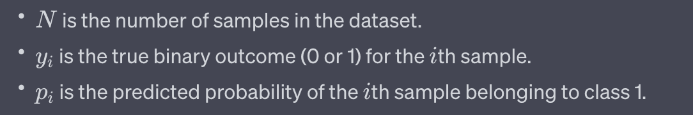

# Data Science Interview question

1. [Can you describe what logistic regression is, and where you might apply it?](#can-you-describe-what-logistic-regression-is-and-where-you-might-apply-it)
2. [Explain how you would handle multicollinearity in a regression analysis.](#explain-how-you-would-handle-multicollinearity-in-a-regression-analysis)
3. [How would you approach residual analysis in a logistic regression model?](#how-would-you-approach-residual-analysis-in-a-logistic-regression-model)
4. [What are some key differences between supervised and unsupervised learning?](#what-are-some-key-differences-between-supervised-and-unsupervised-learning)
5. [Describe your experience with decision trees. What are their main advantages and disadvantages?](#describe-your-experience-with-decision-trees-what-are-their-main-advantages-and-disadvantages)
6. [Explain the k-means algorithm. How do you determine the best number of clusters](#explain-the-k-means-algorithm-how-do-you-determine-the-best-number-of-clusters)
7. [What is the role of loss functions in logistic regression, and how do they work?](#what-is-the-role-of-loss-functions-in-logistic-regression-and-how-do-they-work)
8. [How would you deal with imbalanced classes when working with classification problems?](#how-would-you-deal-with-imbalanced-classes-when-working-with-classification-problems)
9. [Describe the process of cross-validation in the context of model evaluation.](#describe-the-process-of-cross-validation-in-the-context-of-model-evaluation.)
10. [What are the key considerations when pre-processing data for machine learning?](#what-are-the-key-considerations-when-pre-processing-data-for-machine-learning)

11. What are the key considerations when pre-processing data for machine learning?
12. Explain how you would identify and handle outliers in a dataset.
13. How do you select the right algorithm for a specific problem in machine learning?
14. Describe a time when you used k-means clustering in a real-world application.
15. How do you approach feature selection in your models?
16. Can you explain the concept of overfitting and how you would prevent it?
17. How do you evaluate the effectiveness of a machine learning model?
18. What are your preferred tools and technologies for data analysis, and why?
19. How do you ensure the ethical use of data in your analyses?
20. Describe a challenging data project you've worked on and the solutions you implemented.
21. Explain the bias-variance trade-off. How do you find the optimal balance in your models?
22. What are ensemble methods, and how have you used them in your work?
23. How do you interpret the coefficients in a logistic regression model?
24. What are some techniques for handling missing or incomplete data?
25. Explain how you would set up an A/B test to validate a new data-driven feature.
26. Describe your experience with big data technologies.
27. How do you approach the interpretability of complex models like neural networks?
28. What is your philosophy on data visualization, and how do you apply it in your work?
29. How do you approach hyperparameter tuning in machine learning models?
30. What experience do you have with deep learning frameworks?
31. How do you handle the continuous monitoring of a deployed machine learning model?
32. How do you align your data projects with the overall business goals?
33. Explain how you would assess the impact of multicollinearity in a regression model.
34. How do you approach time-series analysis?
35. Describe how you ensure data quality in your projects.
36. How do you approach a new data analysis or machine learning project from scratch?
37. What methods do you use to scale your machine learning models for production?
38. How would you explain the ROC curve to a non-technical stakeholder?
39. What's your approach to collaboration and teamwork in data science projects?
40. Explain how you handle data security and privacy in your work.
41. How do you stay up-to-date with the latest developments in data science and machine learning?
42. How would you approach a situation where data is sparse or of low quality?
43. What role does domain knowledge play in your data analyses?
44. How do you validate the assumptions behind your data models?
45. Describe your experience with different data storage and management systems.
46. Explain the significance of evaluation metrics like precision, recall, and F1 score.
47. What's your experience with cloud computing in data projects?
48. How do you ensure that your models are unbiased and fair?
49. Can you describe a situation where a model's performance surprised you, either positively or negatively?
50. How do you prioritize multiple projects and tasks in a fast-paced environment?

### Can you describe what logistic regression is, and where you might apply it
Linear regression and logistic regression are both types of statistical models used in machine learning and statistics, but they are applied to different types of problems and have distinct characteristics.

**Linear Regression**:
Linear regression is a supervised learning algorithm used for predicting a continuous numerical outcome based on one or more input features. It models the relationship between the dependent variable (output) and one or more independent variables (inputs) by finding the best-fitting linear equation. In essence, it tries to find the straight line that best fits the data points in such a way that the sum of squared differences between the predicted values and the actual values is minimized.

Example:
Let's say you're a real estate agent and you want to predict the selling price of houses based on their square footage. In this case, you would use linear regression. The square footage of the house is the input feature (independent variable), and the selling price is the output (dependent variable). Linear regression would help you find a line that best represents the relationship between square footage and selling price, allowing you to predict the selling price of houses based on their size.

**Logistic Regression**:
Logistic regression, despite its name, is used for binary classification problems. It's used to predict the probability that an instance belongs to a particular class (usually 0 or 1) based on one or more input features. The output of logistic regression is a probability score that is then transformed using a sigmoid function to obtain a value between 0 and 1.

Example:
Imagine you're working for a medical company, and you're developing a model to predict whether a patient has a certain disease based on their medical test results. In this case, you would use logistic regression. The input features could be various medical test measurements, and the output would be a probability of whether the patient has the disease (1) or not (0). Logistic regression would calculate the probability and allow you to classify patients into the appropriate groups based on the probability threshold you choose.

In summary, linear regression is used for predicting continuous numeric values, while logistic regression is used for binary classification problems where the goal is to predict the probability of an instance belonging to a specific class.

### Explain how you would handle multicollinearity in a regression analysis

Multicollinearity occurs in a regression analysis when two or more independent variables in a model are highly correlated with each other. This can cause issues in the interpretation of the model's coefficients and make it difficult to determine the individual contributions of each variable. To handle multicollinearity, consider the following steps:

- **Detect Multicollinearity**:
Start by assessing the degree of multicollinearity among the independent variables. Common methods to detect multicollinearity include calculating correlation matrices, variance inflation factors (VIFs), and condition indices.

- **Reduce the Number of Variables**:
If you identify highly correlated variables, consider removing one of them from the model. However, be careful not to remove variables that are theoretically important or have strong conceptual significance.

- **Combine Variables**:
In some cases, you might be able to combine correlated variables into a single composite variable. This can help reduce multicollinearity. For example, if you have height and weight as independent variables, you might create a body mass index (BMI) variable that captures both aspects.

- **Regularization Techniques**:
Regularization techniques, such as Ridge Regression and Lasso Regression, can help mitigate multicollinearity. These techniques add a penalty term to the model's optimization process, which can reduce the impact of correlated variables on the coefficients.

- **Principal Component Analysis (PCA)**:
PCA is a dimensionality reduction technique that can be used to transform correlated variables into a new set of orthogonal variables (principal components) that are uncorrelated with each other. This can help mitigate multicollinearity, but it might make the interpretation of the model's coefficients more challenging.

- **Domain Knowledge and Feature Selection**:
Rely on your domain knowledge to decide which variables to include in the model. If you have a strong theoretical understanding of the variables, you can make informed decisions about which ones to keep or exclude.

- **Data Collection and Experimental Design**:
When collecting data for regression analysis, consider carefully selecting variables that are less likely to be highly correlated. Additionally, if possible, design experiments or surveys to minimize multicollinearity.

- **Interpretation and Reporting**:
If multicollinearity cannot be completely eliminated, focus on the stability of coefficients and their confidence intervals rather than their magnitudes. Also, consider reporting VIFs to indicate the level of multicollinearity to your audience.

Handling multicollinearity is essential for ensuring the accuracy and interpretability of regression models. The specific approach you choose will depend on the context of your analysis, the goals of your study, and the available data.

### How would you approach residual analysis in a logistic regression model

Residual analysis is a crucial step in evaluating the performance and assumptions of any regression model, including logistic regression. Residuals are the differences between the observed values and the predicted values from the model. In the case of logistic regression, residuals are not normally distributed like in linear regression, but you can still perform meaningful residual analysis to assess the model's fit and assumptions. Here's how you would approach residual analysis in a logistic regression model:

- **Compute Residuals**:
Calculate the residuals by subtracting the predicted probabilities (obtained from the logistic regression model) from the actual binary outcomes (0 or 1).

- **Residual Plots**:
Create residual plots to visually assess the patterns and distributions of the residuals. Common types of residual plots for logistic regression include:

	+ **Residual vs. Fitted Plot**: Plot the residuals against the predicted probabilities. Look for any patterns or trends in the residuals. Ideally, you want to see random scattering around zero, without any clear patterns.

	+ **Quantile-Quantile (Q-Q) Plot**: This plot compares the distribution of the residuals to a theoretical normal distribution. If the residuals deviate significantly from the diagonal line, it indicates departures from normality.

	* **Deviance Residual Plot**: Deviance residuals are specific to logistic regression. Plot these residuals against the predicted values or other relevant variables. Look for patterns that might indicate problems with the model's fit.

- **Homoscedasticity and Heteroscedasticity**:
Check for constant variance of residuals across different levels of predictor variables. If the spread of residuals increases or decreases with changing values of predictors, it could indicate heteroscedasticity, which might impact the reliability of model predictions.

- **Outliers and Influential Points**:
Identify any outliers or influential points that might be disproportionately affecting the model's performance. These could include instances with unusually large or small residuals. Consider investigating whether these cases are genuine data anomalies or need special handling.

- **Goodness of Fit Tests**:
Perform goodness of fit tests to assess the overall fit of the logistic regression model. Common tests include the Hosmer-Lemeshow test or the Pearson chi-squared test. These tests assess whether the predicted probabilities match the observed outcomes across different groups.

- **Residual Patterns and Relationships**:
Examine whether specific patterns or relationships in the residuals indicate issues with the model. For instance, if you notice a U-shaped or inverted U-shaped pattern in the residual plot, it might suggest a non-linear relationship that the model isn't capturing.

- **Adjustments and Model Refinement**:
If you identify substantial problems in the residual analysis, consider refining the model. This might involve adding interaction terms, transforming variables, or using different modeling techniques.

Remember that logistic regression residuals are not normally distributed like in linear regression, so the interpretation and analysis will differ. The goal of residual analysis in logistic regression is to identify any systematic patterns or deviations from assumptions that could indicate potential issues with the model's fit or predictive performance.

### What are some key differences between supervised and unsupervised learning

Supervised learning and unsupervised learning are two fundamental paradigms in machine learning that address different types of tasks and have distinct characteristics. Here are some key differences between the two, along with examples for each:

**Supervised Learning**:
Supervised learning involves training a model on a labeled dataset, where the input data is paired with corresponding target or output labels. The goal of supervised learning is to learn a mapping function that can make accurate predictions on new, unseen data.

**Key Differences**:

+ **Labeling**: In supervised learning, the training data is labeled, meaning that each input is associated with a known output. The model learns to predict these outputs based on the input features.

+ **Objective**: The primary objective of supervised learning is to minimize the difference between the predicted outputs and the actual labels. It aims to generalize from the training data to make accurate predictions on new, unseen data.

**Examples of Supervised Learning**:

+ **Regression**: Predicting a house's price based on its features (square footage, number of bedrooms, etc.).
+ **Classification**: Identifying whether an email is spam or not spam based on its content and features.

**Unsupervised Learning**:
Unsupervised learning involves working with unlabeled data, where the algorithm seeks to find patterns, structures, or relationships within the data without any predefined target labels. The goal of unsupervised learning is often to uncover hidden insights or groupings within the data.

**Key Differences**:

+ **Label Absence**: In unsupervised learning, the data is not labeled. The algorithm tries to discover inherent structures or patterns within the data without any guidance from target labels.

+ **Objective**: The main objective of unsupervised learning is to explore and understand the data's intrinsic properties, such as clustering similar data points or reducing the dimensionality of the data.

**Examples of Unsupervised Learning**:

**Clustering**: Grouping similar customers together based on their purchase behaviors without knowing predefined categories.
Dimensionality Reduction: Reducing the number of variables in a dataset while preserving its relevant information.
In summary, supervised learning deals with labeled data and focuses on making predictions or classifications, while unsupervised learning works with unlabeled data and aims to uncover patterns and structures within the data. Each paradigm serves different purposes in the field of machine learning, and the choice between them depends on the specific task and the nature of the available data.

### Describe your experience with decision trees. What are their main advantages and disadvantages

**Decision Trees**:
Decision trees are a popular machine learning algorithm used for both classification and regression tasks. They represent a tree-like structure where each internal node represents a feature, each branch represents a decision rule, and each leaf node represents an outcome or a predicted value.

**Advantages of Decision Trees**:

+ Interpretability: Decision trees are highly interpretable. The paths in the tree represent clear decision rules, making it easy to understand how predictions are made.

+ No Data Preprocessing: Decision trees can handle both categorical and numerical data without requiring extensive data preprocessing such as normalization or scaling.

+ Non-Linear Relationships: Decision trees can capture complex non-linear relationships between features and the target variable.

+ Feature Importance: Decision trees provide a measure of feature importance, indicating which features have the most significant impact on the predictions.

+ Handling Missing Values: Decision trees can handle missing values by making decisions based on available features in each branch.

+ Visual Representation: The tree structure can be visually represented, which aids in explaining the model's decision-making process to non-technical stakeholders.

**Disadvantages of Decision Trees**:

+ Overfitting: Decision trees can easily overfit the training data, leading to poor generalization on unseen data. Techniques like pruning are used to mitigate overfitting.

+ Instability: Small variations in the data can result in significantly different decision trees, leading to instability in the model's predictions.

+ Bias towards Dominant Classes: In classification tasks with imbalanced classes, decision trees tend to favor the majority class, potentially resulting in poor performance on minority classes.

+ Limited Expressiveness: Decision trees might struggle to capture complex relationships that require a combination of features, as they make decisions based on one feature at a time.

+ Greedy Algorithm: Decision trees are built using a greedy approach, making locally optimal decisions at each step. This might not result in the globally optimal tree structure.

+ Sensitive to Small Variations: Small changes in the training data can lead to significantly different tree structures, potentially impacting the model's reliability.

+ Complexity: While individual decision trees are simple, creating an ensemble of decision trees (Random Forests, Gradient Boosting) can lead to more complex models.

To address some of the disadvantages, techniques like ensemble methods (Random Forests, Gradient Boosting) are often employed to enhance the performance and generalization of decision trees. Despite their limitations, decision trees remain valuable tools in the machine learning toolbox, especially when used in combination with other algorithms and practices to create more robust models.

### Explain the k-means algorithm. How do you determine the best number of clusters

The k-means algorithm is a popular unsupervised machine learning technique used for clustering similar data points into groups or clusters. It aims to partition the data into k distinct clusters, where each data point belongs to the cluster with the nearest mean (centroid). The algorithm iteratively refines the assignment of data points to clusters until convergence.

Here's how the k-means algorithm works:

1. **Initialization:**
   - Choose the number of clusters, k.
   - Randomly initialize k cluster centroids, typically by selecting k data points from the dataset.

2. **Assignment Step:**
   - For each data point, calculate the distance to each centroid and assign the point to the cluster with the closest centroid.

3. **Update Step:**
   - Recalculate the centroids of each cluster by taking the mean of all data points assigned to that cluster.

4. **Repeat Steps 2 and 3:**
   - Iterate through the assignment and update steps until the centroids stabilize or a maximum number of iterations is reached.

The algorithm converges when the centroids no longer change significantly, indicating that the clusters have been formed.

**Determining the Best Number of Clusters (k):**
Determining the optimal number of clusters, k, is a critical aspect of using the k-means algorithm. There are several methods you can use to help you find the right value for k:

1. **Elbow Method:**
   Plot the within-cluster sum of squares (WCSS) against the number of clusters. WCSS measures the squared distances between data points and their respective cluster centroids. The idea is that as the number of clusters increases, WCSS decreases since clusters become more compact. The "elbow point" on the plot is where the rate of decrease slows down. This point can provide a reasonable estimate of the optimal number of clusters.

2. **Silhouette Score:**
   The silhouette score measures how similar an object is to its own cluster compared to other clusters. Compute the silhouette score for different values of k and choose the k that maximizes the silhouette score.

3. **Gap Statistic:**
   The gap statistic compares the performance of the k-means clustering to that of a random distribution. It involves calculating the difference between the observed within-cluster dispersion and the expected dispersion for a given number of clusters. The number of clusters that provides the largest gap is considered the optimal choice.

4. **Cross-Validation:**
   You can perform k-fold cross-validation to assess the stability of clusters for different values of k. Choose the k that leads to consistent and meaningful clusters across different folds.

5. **Domain Knowledge:**
   Sometimes, domain knowledge about the data and the problem can guide you in selecting an appropriate number of clusters.

It's important to note that these methods are not definitive and might yield slightly different results. It's often a good practice to use a combination of these techniques to make an informed decision about the number of clusters that best represents the structure of your data.

### What is the role of loss functions in logistic regression, and how do they work

In logistic regression, loss functions play a crucial role in determining how well the model's predictions match the actual binary outcomes (0 or 1) of the training data. The goal of logistic regression is to find the best-fitting parameters (coefficients) that minimize the chosen loss function. These parameters define the decision boundary that separates the two classes in the data.

The most common loss function used in logistic regression is the **logarithmic loss** or **cross-entropy loss**, also known as the **log loss**. Let's delve into how it works and its role in logistic regression:

**Log Loss (Cross-Entropy Loss):**
The log loss quantifies the difference between the predicted probabilities (obtained from the logistic regression model) and the actual binary outcomes. It's defined mathematically as:

Where:

The log loss has several important properties that make it suitable for logistic regression:
- It penalizes larger errors more heavily, as the logarithmic term amplifies the difference between predicted and actual values.
- It encourages the model to make confident and accurate predictions by rewarding high confidence (close to 1) for correct predictions and high confidence (close to 0) for incorrect predictions.
- It's a continuous and differentiable function, which makes it suitable for optimization using gradient-based methods.

**Role of Log Loss:**
In logistic regression, the goal is to find the parameter values (coefficients) that minimize the log loss across the training dataset. This process is often performed using optimization techniques like gradient descent. By minimizing the log loss, the model learns to adjust its parameters in a way that maximizes the likelihood of the observed binary outcomes given the input features.

The log loss serves as a measure of how well the model's predicted probabilities match the actual outcomes. Lower log loss values indicate better alignment between predictions and outcomes, leading to a more accurate and well-calibrated model.

In summary, the log loss is a critical component of logistic regression, as it guides the optimization process to find parameter values that result in accurate predictions for binary classification tasks.

### How would you deal with imbalanced classes when working with classification problems

Dealing with imbalanced classes is a common challenge in classification problems where one class significantly outnumbers the other(s). This can lead to biased models that perform well on the majority class but poorly on the minority class. Addressing class imbalance is important to ensure fair and accurate model performance. Here are some strategies you can use:

1. **Resampling Techniques:**
   - **Oversampling:** Increase the number of instances in the minority class by duplicating or generating synthetic data points.
   - **Undersampling:** Decrease the number of instances in the majority class by randomly removing data points.
   - **SMOTE (Synthetic Minority Over-sampling Technique):** Generate synthetic examples for the minority class by interpolating between existing instances.

2. **Cost-Sensitive Learning:**
   Modify the algorithm's learning algorithm to assign different misclassification costs for different classes. This makes the model more sensitive to the minority class.

3. **Ensemble Methods:**
   Use ensemble methods that combine multiple models. Techniques like **Random Forests** and **Gradient Boosting** are less prone to class imbalance issues due to their inherent nature of combining multiple weak learners.

4. **Anomaly Detection:**
   Treat the minority class as an anomaly detection problem. This involves considering the minority class as rare events and using techniques like **One-Class SVM** or **Isolation Forest**.

5. **Evaluation Metrics:**
   Instead of using accuracy alone, choose evaluation metrics that are more suitable for imbalanced datasets, such as **precision, recall, F1-score, or area under the ROC curve (AUC-ROC)**.

6. **Algorithm Selection:**
   Choose algorithms that inherently handle imbalanced classes better, such as **Support Vector Machines (SVMs) with class weights** or **XGBoost with parameter tuning**.

7. **Data Augmentation:**
   If feasible, augment the minority class with additional features to make it easier for the model to distinguish between classes.

8. **Resampling with Care:**
   When using resampling techniques, be cautious not to overfit the model to the minority class. Cross-validation and proper hyperparameter tuning are essential.

9. **Domain Knowledge:**
   Leverage domain expertise to make informed decisions about handling class imbalance, as certain situations may warrant specific approaches.

It's important to note that the choice of strategy depends on the specific problem, the available data, and the goals of your analysis. Experiment with multiple techniques and evaluate their impact on the model's performance using appropriate evaluation metrics. Additionally, be mindful of the potential trade-offs and challenges introduced by each strategy.

### Describe the process of cross-validation in the context of model evaluation.

Cross-validation is a vital technique used to assess the performance and generalization ability of machine learning models. It involves partitioning the dataset into multiple subsets, training and testing the model on different subsets, and then averaging the results to get a more reliable estimate of the model's performance.

Here's the process of cross-validation in the context of model evaluation:

1. **Data Splitting:**
   - The original dataset is split into two or more subsets: a **training set** used to train the model and a **validation/test set** used to evaluate its performance.

2. **k-Fold Cross-Validation:**
   - One common form of cross-validation is **k-fold cross-validation**. The training set is further divided into k equally sized folds or subsets.
   - The model is trained on k-1 folds and validated on the remaining fold. This process is repeated k times, with each fold serving as the validation set once.

3. **Metrics Calculation:**
   - For each iteration (fold), the model's performance metrics (e.g., accuracy, precision, recall) are calculated on the validation set.

4. **Average Metrics:**
   - The performance metrics obtained from all iterations are averaged to obtain a more stable estimate of the model's performance.

5. **Parameter Tuning:**
   - Cross-validation is often used in hyperparameter tuning. Different combinations of hyperparameters are tested on different folds, and the combination with the best average performance is selected.

6. **Final Model Training:**
   - After parameter tuning, the final model is trained on the entire training set using the selected hyperparameters.

7. **Evaluation on Test Set:**
   - The model's final performance is evaluated on the test set, which has not been used for training or validation during cross-validation. This gives an estimate of the model's performance on unseen data.

Advantages of Cross-Validation:
- Provides a more robust estimate of model performance by reducing the impact of randomness in data splitting.
- Utilizes the entire dataset for both training and validation, which is especially important when the dataset is limited.
- Helps identify whether the model is overfitting or underfitting by observing the consistency of performance metrics across folds.

Common Variations of Cross-Validation:
- **Stratified k-Fold Cross-Validation:** Maintains the class distribution in each fold, ensuring that all classes are represented in each training and validation set.
- **Leave-One-Out Cross-Validation (LOOCV):** Each fold contains only one data point as the validation set, and the rest are used for training. This is computationally expensive but can provide accurate estimates for small datasets.

Cross-validation is a fundamental tool in machine learning that aids in choosing the right model, tuning hyperparameters, and obtaining reliable performance estimates, ultimately leading to better decision-making in model selection and deployment.

### What are the key considerations when pre-processing data for machine learning

Pre-processing data is a crucial step in preparing your dataset for machine learning. Proper data pre-processing can significantly impact the performance and reliability of your models. Here are some key considerations to keep in mind when pre-processing data:

1. **Handling Missing Values:**
   Decide on a strategy for dealing with missing values. Options include removing rows with missing values, imputing missing values using mean, median, or more advanced methods, or treating missing values as a separate category.

2. **Data Scaling and Normalization:**
   Scale numerical features to similar ranges to prevent some features from dominating others during model training. Techniques include Min-Max scaling, Standardization (z-score scaling), and Robust scaling.

3. **Encoding Categorical Variables:**
   Convert categorical variables into a numerical format that models can understand. This can be achieved using techniques like one-hot encoding, label encoding, or target encoding.

4. **Feature Engineering:**
   Create new features based on domain knowledge or insights that might improve model performance. This could involve mathematical transformations, creating interaction terms, or deriving new features from existing ones.

5. **Dimensionality Reduction:**
   If you have a large number of features, consider dimensionality reduction techniques like Principal Component Analysis (PCA) or feature selection methods to reduce the complexity of the dataset while preserving relevant information.

6. **Handling Imbalanced Classes:**
   When dealing with imbalanced datasets, apply techniques such as oversampling, undersampling, or using algorithms that handle class imbalance well (e.g., weighted loss functions).

7. **Outlier Detection and Handling:**
   Identify and handle outliers that could negatively impact model performance. Outliers can be removed, transformed, or treated as missing values.

8. **Time Series Pre-processing:**
   For time series data, consider techniques such as resampling, lagging variables, and handling seasonality or trend components.

9. **Text Data Pre-processing:**
   For text data, perform tokenization, lowercasing, removal of stop words and special characters, stemming or lemmatization, and creating numerical representations like TF-IDF or word embeddings.

10. **Validation and Testing Set Split:**
    Separate your dataset into training, validation, and testing sets. The validation set helps in tuning hyperparameters, while the testing set provides an unbiased estimate of your model's performance on unseen data.

11. **Maintaining Consistency:**
    Ensure consistency in pre-processing steps between training and validation/testing datasets to avoid data leakage or model mismatch issues.

12. **Domain Knowledge:**
    Leverage your understanding of the domain and problem to make informed decisions about pre-processing steps that are appropriate for your specific context.

Remember that the pre-processing steps you choose should align with your data's characteristics, the goals of your analysis, and the requirements of the machine learning algorithm you plan to use. Thorough pre-processing can lead to more accurate, stable, and reliable models.